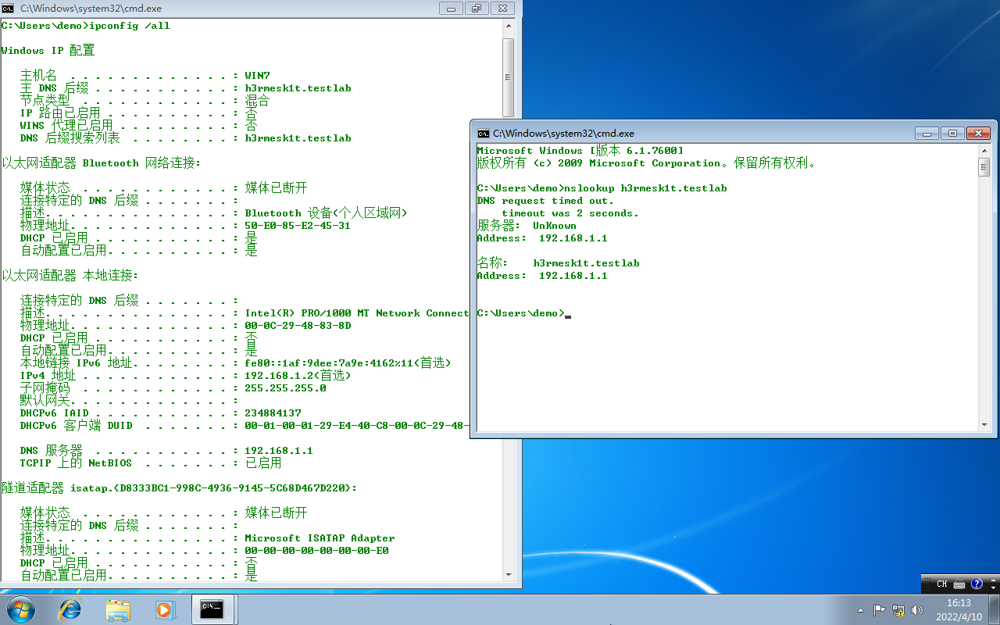
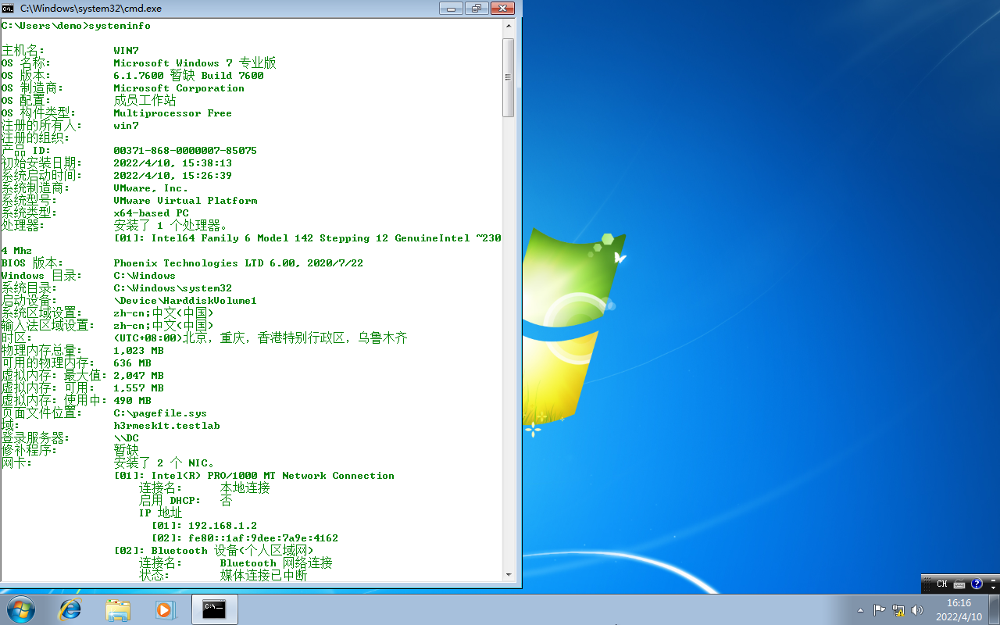
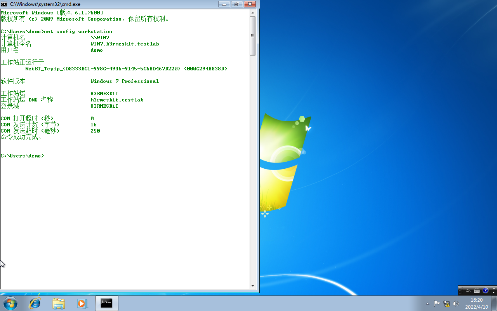
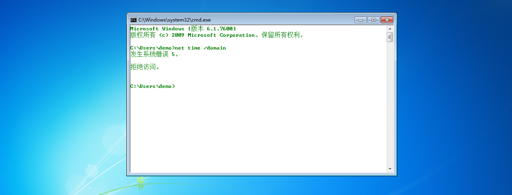

# 域信息搜集

Author: H3rmesk1t

Data: 2022.04.11

# 判断是否存在域
获得本机相关信息之后, 就要判断当前内网中是否存在域. 如果当前内网存在域, 则需要判断所控主机是否在域内.

## 使用 ipconfig 命令
使用`ipconfig`命令可查看网关`IP`地址、`DNS`的`IP`地址、域名、本机是否和`DNS`服务器处于同一网段等信息. 然后通过反向解析查询命令`nslookup`来解析域名的`IP`地址, 用解析得到的`IP`地址进行对比, 判断`DC`和`DNS`服务是否在同一台服务器上.

```sh
ipconfig /all
nslookup xxx
```

<div align=center></div>

## 查看系统详细信息
显示项的"域"即域名, "登录服务器"即域控制器, 若"域"为`WORKGROUP`则表示当前机器不在域内.

```sh
systeminfo
```

<div align=center></div>

## 查询当前登录域及登录用户信息
显示项的"工作站域`DNS`名称"即域名(若为`WORKGROUP`则表示不在域中), "登录域"用于表示当前登录的用户是域用户还是本地用户.

```sh
net config workstation
```

<div align=center></div>

## 判断主域

```sh
net time /domain
```

上述命令用于判断主域(域服务器通常会同时作为时间服务器使用), 执行后通常会有如下三种情况:
 - 存在域, 但当前用户不是域用户.
 - 存在域, 且当前用户是域用户.
 - 当前网络环境为工作组, 不存在域.

例如下图情况即为存在域但当前用户并不是域用户:

<div align=center></div>

# 探测域内存活主机
探测域内存活主机是内网渗透测试中不可或缺的一个环节, 可在白天和晚上分别进行探测, 以对比分析存活主机和对应的`IP`地址. 在进行域内存活主机探测的时候, 有几个注意点:
 - 尽量避免触发域内的一些防病毒软件的告警和拦截.
 - 在非授权情况下, 避免使用工具进行暴力扫描.
 - 尽量避免在目标机子上使用图形化工具.
 - 尽量使用系统自带的工具进行探测, 如`powershell`脚本.

