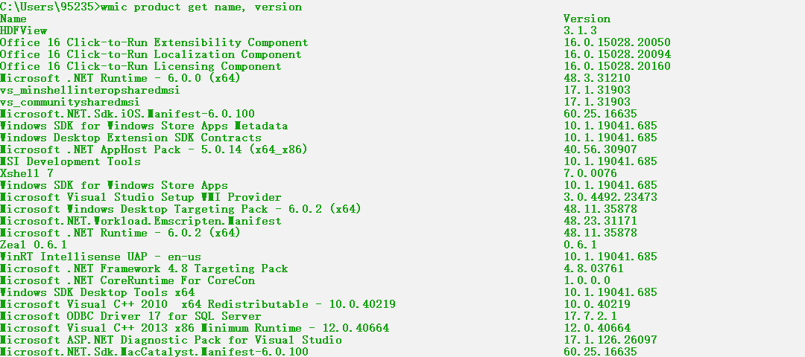

# 本机信息搜集

Author: H3rmesk1t

Data: 2022.04.11

# 收集本机信息
## 手动搜集
本机信息包括操作系统、权限、内网`IP`地址段、杀毒软件、端口、服务、补丁更新频率、网络连接、会话等. 如果是域内主机，操作系统、应用软件、补丁、服务、杀毒软件一般是批量安装的。

### 查询网络配置信息

```sh
ipconfig /all
```

<div align=center></div>

### 查询操作系统及软件的信息
 - 查询操作系统和版本信息

```sh
systeminfo | findstr /B /C:"OS Name" /C:"OS Version"
systemindo | findstr /B /C:"OS 名称" /C:"OS 版本"
```

<div align=center></div>

 - 查看系统体系结构

```sh
echo %PROCESSOR_ARCHITECTURE%
```

<div align=center></div>

 - 查看安装的软件及版本、路径等

```sh
wmic product get name,version
powershell "Get-WmiObject -class Win32_Product | Select-Object -Property name,version"
```

<div align=center></div>

<div align=center></div>

### 查询本机服务信息

```sh
wmic service list brief
```

<div align=center></div>

### 查询进程列表

```sh
tasklist
wmic process list brief
```

<div align=center></div>

<div align=center></div>

|    杀软名称     |          进程名称          |
| :-------------: | :------------------------: |
|360tray.exe|360安全卫士|
|360sd.exe|360杀毒|
|a2guard.exe|a-squared杀毒|
|ad-watch.exe|Lavasoft杀毒|
|cleaner8.exe|The Cleaner杀毒|
|vba32lder.exe|vb32杀毒|
|MongoosaGUI.exe|Mongoosa杀毒|
|CorantiControlCenter32.exe|Coranti2012杀毒|
|F-PROT.EXE|F-PROT杀毒|
|CMCTrayIcon.exe|CMC杀毒|
|K7TSecurity.exe|K7杀毒|
|UnThreat.exe|UnThreat杀毒|
|CKSoftShiedAntivirus4.exe|Shield Antivirus杀毒|
|AVWatchService.exe|VIRUSfighter杀毒|
|ArcaTasksService.exe|ArcaVir杀毒|
|iptray.exe|Immunet杀毒|
|PSafeSysTray.exe|PSafe杀毒|
|nspupsvc.exe|nProtect杀毒|
|SpywareTerminatorShield.exe|SpywareTerminator杀毒|
|BKavService.exe|Bkav杀毒|
|MsMpEng.exe|Microsoft Security Essentials|
|SBAMSvc.exe|VIPRE|
|ccSvcHst.exe|Norton杀毒|
|QQ.exe|QQ|
|f-secure.exe|冰岛|
|avp.exe|卡巴斯基|
|KvMonXP.exe|江民杀毒|
|RavMonD.exe|瑞星杀毒|
|Mcshield.exe|麦咖啡|
|egui.exe|NOD32|
|kxetray.exe|金山毒霸| 
|knsdtray.exe|可牛杀毒|
|avcenter.exe|Avira(小红伞)|
|ashDisp.exe|Avast网络安全| 
|rtvscan.exe|诺顿杀毒| 
|ksafe.exe|金山卫士| 
|QQPCRTP.exe|QQ电脑管家|
|Miner.exe|流量矿石|
|AYAgent.aye|韩国胶囊|
|patray.exe|安博士|
|V3Svc.exe|安博士V3|
|avgwdsvc.exe|AVG杀毒|
|ccSetMgr.exe|赛门铁克|
|QUHLPSVC.EXE|QUICK HEAL杀毒|
|mssecess.exe|微软杀毒|
|SavProgress.exe|Sophos杀毒|
|fsavgui.exe|F-Secure杀毒|
|vsserv.exe|比特梵德|
|remupd.exe|熊猫卫士|
|FortiTray.exe|飞塔|
|parmor.exe|木马克星|
|beikesan.exe|贝壳云安全|
|KSWebShield.exe|金山网盾|
|TrojanHunter.exe|木马猎手|
|GG.exe|巨盾网游安全盾|
|adam.exe|绿鹰安全精灵|
|AST.exe|超级巡警|
|ananwidget.exe|墨者安全专家|
|AVK.exe|GData|
|ccapp.exe|Symantec Norton|
|avg.exe|AVG Anti-Virus|
|spidernt.exe|Dr.web|
|Mcshield.exe|Mcafee|
|avgaurd.exe|Avira Antivir|
|F-PROT.exe|F-Prot AntiVirus|
|vsmon.exe|ZoneAlarm|
|avp.exee|Kaspersky|
|cpf.exe|Comodo|
|outpost.exe|Outpost Firewall|
|rfwmain.exe|瑞星防火墙|
|kpfwtray.exe|金山网镖|
|FYFireWall.exe|风云防火墙|
|MPMon.exe|微点主动防御|
|pfw.exe|天网防火墙|
|S.exe|在抓鸡|
|1433.exe|在扫1433|
|DUB.exe|在爆破|
|ServUDaemon.exe|发现S-U|
|BaiduSdSvc.exe|百度杀软|
|hipstray.exe\wsctrl.exe\usysdiag.exe|火绒|
|yunsuo_agent_service.exe\yunsuo_agent_daemon.exe|云锁|
|safedog.exe\SafeDogGuardCenter.exe\safedogupdatecenter.exe\safedogguardcenter.exe\SafeDogSiteIIS.exe\SafeDogTray.exe\SafeDogServerUI.exe|安全狗|
|D_Safe_Manage.exe\d_manage.exe|D盾|
|HwsPanel.exe\hws_ui.exe\hws.exe\hwsd.exe|护卫神|

### 查看启动程序信息

```sh
wmic startup get command,caption
```

<div align=center></div>

### 查看计划任务

```sh
schtasks /query /fo LIST /v
```

<div align=center></div>

### 查看主机开机时间

```sh
net statistics workstation
```

<div align=center></div>

### 查询用户列表

 - 查看本机用户列表
```sh
net user
```

<div align=center></div>

 - 获取本地管理员信息

```sh
net localgroup administrators
```

<div align=center></div>

 - 查看当前在线用户

```sh
query user || qwinsta
```

<div align=center></div>

### 列出或断开本地计算机与所连接的客户端之间的会话

```sh
net session
```

<div align=center></div>

### 查询端口列表

```sh
netstat -ano
```

<div align=center></div>

### 查看补丁列表

 - 查看系统详细信息(需要注意系统的版本、位数、域、补丁信息及更新频率等, 域内主机的补丁通常是批量安装的, 通过查看本机补丁列表就可以找到未打补丁的漏洞.)

```sh
systeminfo
```

<div align=center></div>

 - 查看安装在系统中的补丁

```sh
wmic qfe get Caption,Description,HotFixID,InstalledOn
```

<div align=center></div>

### 查询本机共享列表

```sh
net share
wmic share get name,path,status
```

<div align=center></div>

### 查询路由表及所有可用接口的 ARP 缓存表

```sh
route print
arp -a
```

<div align=center></div>

<div align=center></div>

### 查询防火墙相关配置

 - 关闭防火墙

```sh
// Windows Server 2003 及以前版本

netsh firewall set opmode disable

// Windows Server 2003 以后版本

netsh advfirewall set allprofiles state off
```

<div align=center></div>

 - 查看防火墙配置

```sh
netsh firewall show config
```

<div align=center></div>

 - 修改防火墙配置

```sh
// Windows Server 2003 及以前版本允许指定程序全部连接

netsh firewall add allowedprogram c:\nc.exe "allow nc" enable

// Windows Server 2003 以后版本允许程序进入

netsh advfirewall firewall add rule name="pass nc" dir=in action=allow

// Windows Server 2003 以后版本允许程序退出

netsh advfirewall firewall add rule name="Allow nc" dir=out action=allow program="C:\nc.exe"

// Windows Server 2003 以后版本允许放行 3389 端口

netsh advfirewall firewall add rule name="Remote Desktop" protocol=TCP dir=in localport=3389 action=allow
```

 - 自定义防火墙日志的存储位置

```sh
netsh advfirewall set currentprofile logging filename "C:\windows\temp\h3.log"
```

### 查看代理配置情况
执行如下命令即可看到服务器`127.0.0.1:1080`的代理配置信息.

```sh
reg query "HKEY_CURRENT_USER\Software\Microsoft\Windows\CurrentVersion\Internet Settings"
```

<div align=center></div>

### 查询并开启远程连接服务

 - 查看远程连接端口

```sh
reg query "HKEY_LOCAL_MACHINE\SYSTEM\CurrentControlSet\Control\Terminal Server\WinStations\RDP-Tcp" /V PortNumber
```

<div align=center></div>

 - 在`Windows Server 2003`中开启`3389`端口

```sh
wmic path win32_terminalservicesetting where (__CLASS !="")  call setallowtsconnections 1
```

 - 在`Windows Server 2008`和`Windows Server 2012`中开启`3389`端口

```sh
wmic /namespace:\\root\cimv2\terminalservices path win32_terminalservicesetting where (__CLASS !="") call setallowtsconnections 1

wmic /namespace:\\root\cimv2\terminalservices path win32_tsgeneralsetting where (TerminalName='RDP-Tcp') call setuserauthenticationrequired 1

reg add "HKLM\SYSTEM\CURRENT\CONTROLSET\CONTROL\TERMINAL SERVER" /v fSingleSessionPerUser /t REG_DWORD /d 0 /f
```

## 自动收集
为了简化前面手动收集信息的操作, 可以直接创建一个脚本文件来自动完成前面的信息查询等工作, 这里推荐一个使用`WMIC`收集目标机器信息的脚本. `WMIC`(Windows Management Instrumentation Command-Line, `Windows`管理工具命令行)是最有用的`Windows`命令行工具. 在默认情况下, 任何版本的`Windows XP`的低权限用户不能访问`WMIC`, `Windows 7`以上版本的低权限用户允许访问`WMIC`并执行相关操作. [下载地址](http://www.fuzzysecurity.com/scripts/files/wmic_info.rar)

查看该脚本代码, 本质就是执行一些`wmic`查询命令然后将查询结果保存到`html`文件中:

```sh
for /f "delims=" %%A in ('dir /s /b %WINDIR%\system32\*htable.xsl') do set "var=%%A"

wmic process get CSName,Description,ExecutablePath,ProcessId /format:"%var%" >> out.html
wmic service get Caption,Name,PathName,ServiceType,Started,StartMode,StartName /format:"%var%" >> out.html
wmic USERACCOUNT list full /format:"%var%" >> out.html
wmic group list full /format:"%var%" >> out.html
wmic nicconfig where IPEnabled='true' get Caption,DefaultIPGateway,Description,DHCPEnabled,DHCPServer,IPAddress,IPSubnet,MACAddress /format:"%var%" >> out.html
wmic volume get Label,DeviceID,DriveLetter,FileSystem,Capacity,FreeSpace /format:"%var%" >> out.html
wmic netuse list full /format:"%var%" >> out.html
wmic qfe get Caption,Description,HotFixID,InstalledOn /format:"%var%" >> out.html
wmic startup get Caption,Command,Location,User /format:"%var%" >> out.html
wmic PRODUCT get Description,InstallDate,InstallLocation,PackageCache,Vendor,Version /format:"%var%" >> out.html
wmic os get name,version,InstallDate,LastBootUpTime,LocalDateTime,Manufacturer,RegisteredUser,ServicePackMajorVersion,SystemDirectory /format:"%var%" >> out.html
wmic Timezone get DaylightName,Description,StandardName /format:"%var%" >> out.html
```

<div align=center></div>

# 查询当前权限
## 查看当前权限

```sh
whoami
```

通过该命令, 一般可以区分出当前用户是属于以下哪种用户:
 - 本地普通用户
 - 本地管理员用户
 - 域内用户

在这三种情况下, 如果当前内网中存在域, 那么本地普通用户是查询不到内网域信息的, 只能查询本机相关信息, 但是本机管理员用户和域内用户则可以查询域内信息. 其原理在于: 域内的所有查询都是通过`DC`实现的(基于`LDAP`协议), 而这个查询需要经过权限认证, 所以只有域用户才拥有这个权限; 当域用户执行查询命令时, 会自动使用`Kerberos`协议进行认证, 无须额外输入账号密码.

本地管理员`Administrator`权限可以直接提升为`Ntauthority`或`System`权限, 因此在域中除了普通用户外, 所有的机器都有一个机器用户(用户名是机器名加上`$`). 在本质上, 机器的`System`用户对应的就是域里面的机器用户. 所以, 使用`System`权限可以运行域内的查询命令.

例如下图中是`h3rmesk1t`域内的`demo`用户:

<div align=center></div>

## 获取域 SID

```sh
whoami /all
```

<div align=center></div>

可以看到当前域`h3rmesk1t`的`SID`为`S-1-5-21-2024446040-794895038-1609524491`, 域用户`demo`的`SID`为`S-1-5-21-2024446040-794895038-1609524491-1105`.

## 查询指定用户的详细信息

```sh
net user xxx /domain
```

<div align=center></div>