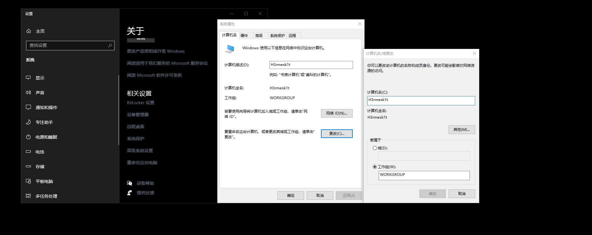
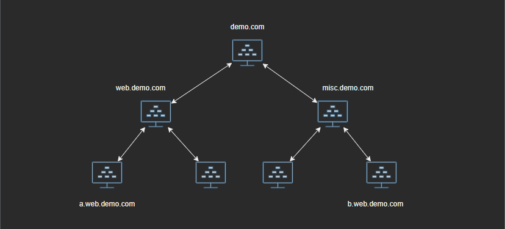
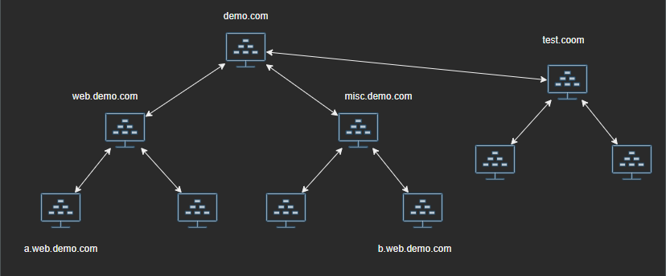
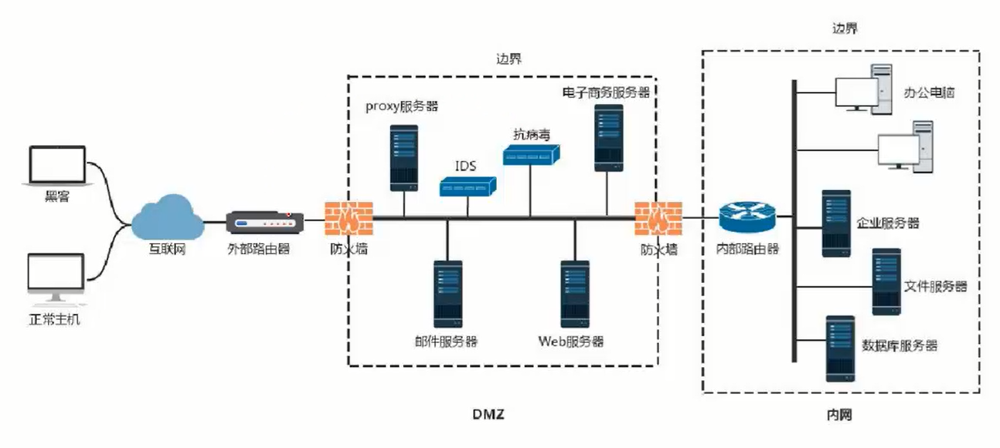

# 内网基础知识

Author: H3rmesk1t

Data: 2022.04.09

# 工作组
在一个大型单位中, 可能存在成百上千台计算机互相连接组成互联网, 它们都会列在"网络"内, 引入工作组(Work Group)这个概念, 将不同的计算机按功能(或部门)分别列入不同的工作组, 例如技术部的计算机都列入"技术部"工作组、行政部的计算机都列入"行政部"工作组.

加入/创建工作组的方法: 此电脑右键属性 - 高级系统设置 - 计算机名 - 更改.

# 域
## 域
域一个有安全边界(两个域中, 一个域中的用户无法访问另一个域中的资源)的计算机集合. 与工作组相比, 域的安全管理控制机制更加严格. 用户想要访问域内的资源, 必须以合法的身份登录域, 而用户对域内的资源拥有什么样的权限, 还取决于用户在域内的身份.

## 域控制器
域控制器(Domain Controller, DC)是域中的一台类似管理服务器的计算机, 负责所有连入的计算机和用户的验证工作, 域内的计算机如果想要互相访问, 都要经过域控制器的审核. 域控制器中存在由这个域的账户、密码、属于这个域的计算机等信息构成的数据库.

## 单域
通常, 在一个地理位置固定的小公司里, 建立一个域就可以满足需求. 在一个域内, 一般要有至少两台域服务器, 一台作为`DC`, 另一台作为备份`DC`, 活动目录的数据库(包括用户的账号信息)是存储在`DC`中的. 如果没有备份`DC`, 一旦`DC`瘫痪了, 域内其它用户就不能登录该域; 如果有备份`DC`, 该域还能正常使用.

## 父域和子域
处于管理及其它需求, 需要在网络中划分多个域, 第一个域称为父域, 各部分的域称为该域的子域.

## 域树
域树(Tree)是多个域通过建立信任关系组成的集合. 一个域管理员只能管理本域, 不能访问或者管理其它域. 如果两个域之间需要互相访问, 则需要建立信任关系(Trust Relation). 信任关系是联系不同域的桥梁, 域树内的父域和子域, 不但可以按照需要互相管理, 还可以跨网络分配文件和打印机等设备及资源, 从而在不同的域之间实现网络资源的共享和管理. 域树结构拓扑图如下:

## 域森林
域森林(Forset)是指多个域树通过建立信任关系组合的集合. 例如, 在一个公司兼并场景中, `A`公司使用域树`demo.com`, `B`公司使用域树`test.com`, 域树`demo.com`无法挂在域树`test.com`下. 因此, 域树`demo.com`与域树`test.com`之间需要通过建立信任关系来构成域森林. 通过域树之间的信任关系, 可以管理和使用整个域森林中的资源, 并保留被兼并公司自身原有的特性.

## 域名服务器
域名服务器(Domain Name Server, DNS)是指用于实现域名和与之相应的`IP`地址转换的服务器. 在内网渗透测试中, 大都是通过寻找`DNS`服务器来确定与控制器的位置(`DNS`服务器和域控制器通过配置在同一台机器上).

# 活动目录
活动目录(Active Directory, AD)是指域环境中提供目录服务的组件. 目录用于存储有关网络对象(例如用户、组、计算机、共享资源、打印机和联系人)等的信息. 目录服务是指帮助用户快速、准确地从目录中找到其所需要的信息的服务. 活动目录实现了目录服务, 为企业提供了网络环境的集中式管理机制.

活动目录的逻辑结构包括组织单元(OU)、域、域树、域森林. 域树内的所有域共享一个活动目录, 这个活动目录内的数据分散存储在各个域中, 且每个域只存储该域内的数据.

要实现域环境, 实际就是要安装`AD`. 如果内网中的一台计算机上安装了`AD`, 它就变成了`DC`(用于存储活动目录数据库的计算机).

# 安全域划分
划分安全域的目的是将一组安全等级相同的计算机划入同一个网段, 这个网段内的计算机拥有相同的网络边界, 并在网络边界上通过部署防火墙来实现对其他安全域的网络访问控制策略(NACL), 从而对允许哪些`IP`地址访问此域、允许此域访问哪些`IP`地址和网段进行设置. 这些措施使得网络风险最小化, 当攻击发生时, 可以尽可能地将威胁隔离, 从而降低对域内计算机的影响.

如下图所示, 一个典型的中小型内网的安全域划分, 一个虚线框代表一个安全域(一般分为`DMZ`和内网), 通过硬件防火墙的不同端口实现隔离.

在一个内网环境中, 通常可以将网络划分为三个区域: 安全级别最高的内网; 安全级别中等的`DMZ`; 安全级别最低的外网. 其中, `DMZ`称为隔离区, 是为了解决安装防火墙后外部网络无法访问内部网络服务器的问题而设立的一个非安全系统与安全系统之间的缓冲区, `DMZ`介于企业外部网络和内部网络之间.

在配置一个拥有`DMZ`的网络时, 通常需要定义如下访问控制策略:
 - 内网可以访问到外网.
 - 内网可以访问`DMZ`.
 - 外网不能访问内网.
 - 外网可以访问`DMZ`.
 - `DMZ`不能访问内网.
 - `DMZ`不能访问外网(存在例外情况, 如邮件服务器等).

# 域中计算机分类
## 域控制器
域控制器用于管理所有的网络访问, 包括登陆服务器、访问共享目录和资源. 域控制器中存储了所有的账户和策略信息, 包括安全策略、用户身份验证信息和账户信息. 

## 成员服务器
成员服务器是指安装了服务器操作系统并加入了域, 但没有安装活动目录的计算机, 其主要任务是提供网络资源. 成员服务器的类型通常有文件服务器、应用服务器、数据库服务器、`Web`服务器、邮件服务器、防火墙、远程访问服务器、打印服务器等. 

## 客户机
域中的计算机可以是安装了其他操作系统的计算机, 用户利用这些计算机和域中的账户就可以登录域, 这些计算机被称为域中的客户机. 

## 独立服务器
如果服务器既不加入域, 也不安装活动目录, 就称其为独立服务器. 独立服务器可以创建工作组、与网络中的其他计算机共享资源, 但不能使用活动目录提供的任何服务. 

# 域内权限
域相关内置组主要包括本地组、全局组和通用组, 可以简单的记作:
 - 域本地组：来自全林, 作用于本域.
 - 全局组：来自本域, 作用于全林.
 - 通用组：来自全林, 作用于全林.

## 域本地组
域本地组是指多域用户访问单域资源(访问同一个域), 主要用于授权本域内资源的访问权限. 域本地组的成员可以来自域林中的任何域, 域本地组用来访问同一域中的资源. 

## 全局组
全局组是指单域用户访问多域资源(必须是一个域里面的用户), 只能在创建该全局组的域中添加用户和全局组. 全局组的成员可包括其所在域中的其他组和账户, 而且可在林中的任何域中指派权限. 

## 通用组
通用组是指多域用户访问多域资源. 通用组的成员可包括域树或域林中任何域的其他组和账户, 而且可在该域树或域林中的任何域中指派权限. 

## A-G-DL-P 策略
`A-G-DL-P`策略(A：Account, 用户账号; G：Global Group, 全局组; DL：Domain Local Group, 域本地组; P：Permission, 资源权限)是指将用户账号添加到全局组中, 将全局组添加到域本地组中, 然后为域本地组分配资源权限. `A-G-DL-P`策略是为了方便对用户进行组织和管理. 当需要给一个用户添加某个权限时, 只需要把这个用户添加到某一个域本地组中就可以了. 