# 内网环境搭建

Author: H3rmesk1t

Data: 2022.04.10

# 域环境搭建
利用`Windows Server 2012 R2`服务器创建一个域环境, 接着将`Windows 7`计算机加入到该域中.

## Windows Server 2012 R2 服务器
安装服务器时, 产品密钥可以参考[密钥管理服务 (KMS) 客户端激活和产品密钥](https://docs.microsoft.com/zh-cn/windows-server/get-started/kms-client-activation-keys).

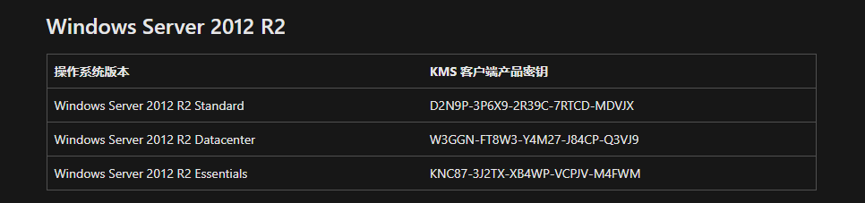

配置`IP`地址为`192.168.1.1`, 子网掩码为`255.255.255.0`, `DNS`指向本机`IP`地址.

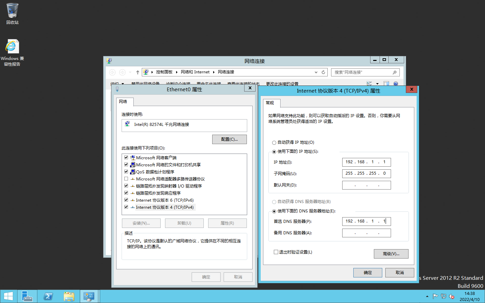

接着修改计算机名: 控制面板 - 系统和安全 - 系统 - 更改设置 - 更改, 然后把计算机名改为`DC`, 点击确定后重启计算机生效.

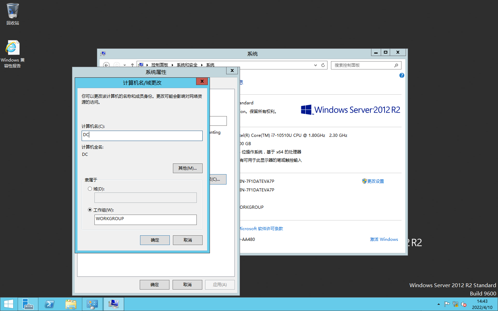

接着安装域控制器和`DNS`服务, 点击"添加角色和功能", 保持默认设置, 单击"下 一步"按钮, 进入"安装类型"页面. 选择"基于角色或者基于功能的安装"选项, 单击"下一 步"按钮, 进入"服务器选择"选择页面. 目前的服务器池中只有当前这一台机器, 保持默认设置. 单击"下一步"按钮, 在"服务器角色"页面勾选"`Active Directory`域服务"和"`DNS`服务器"复选框.

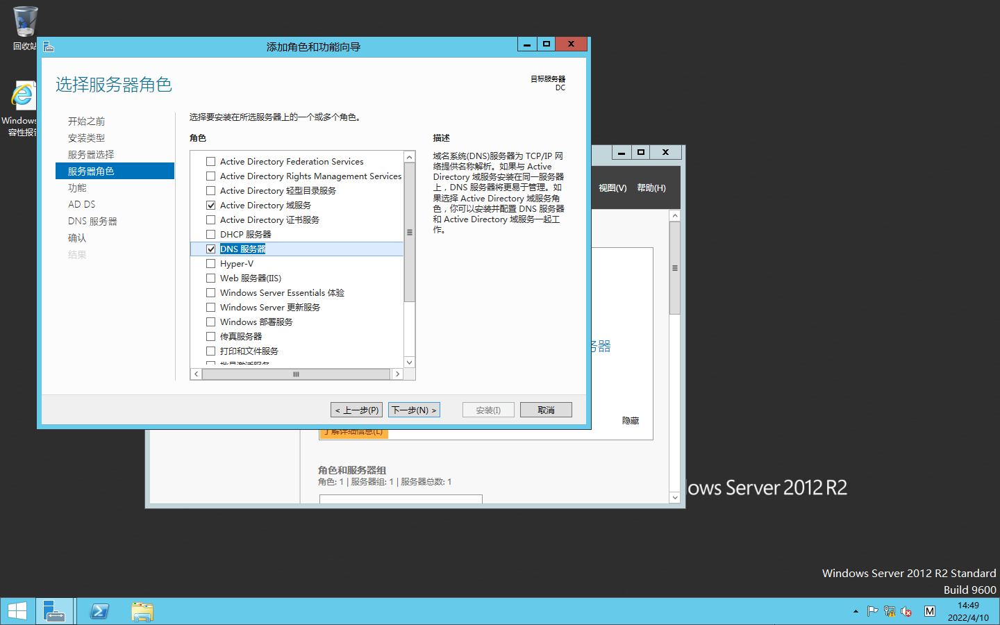

在"功能"页面, 保持默认设置, 单击"下一步"按钮, 进入"确认"页面. 确认需要安装 的组件后, 勾选"如果需要, 自动重新启动目标服务器"复选框, 然后单击安装:

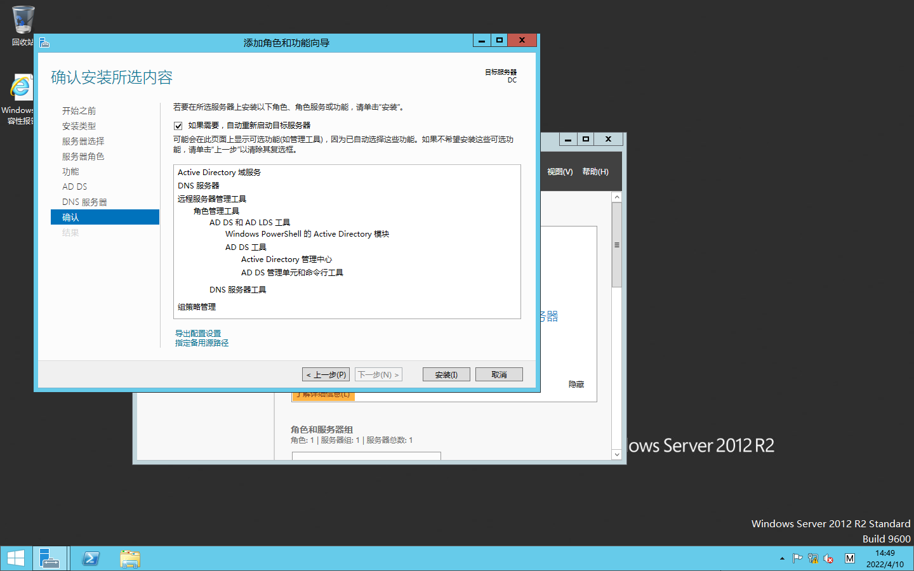

`Active Directory`域服务安装完成后, 需要将此服务器提升为域控制器. 单击"将此服务器提 升为域控制器"选项(如果不慎单击了"关闭"按钮, 可以在"服务器管理器"页面中打开相关页面), 在右上角可以看到一个中间有`!`的三角形按钮. 单击该按钮, 提升服务器:

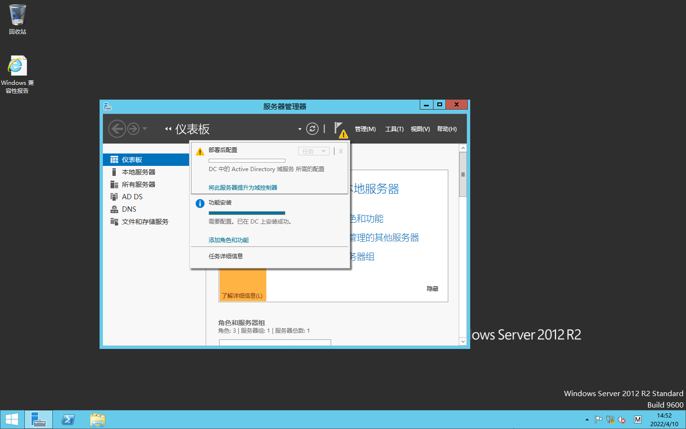

`AD`域服务安装完成后, 接着进入"`Active Directory`域服务配置向导"页面, 在部署操作中单击选中"添加新林"单选按钮并输入根域名(必须使用允许的`DNS`域命名约定), 将根域名设置为`h3rmesk1t.testlab`:

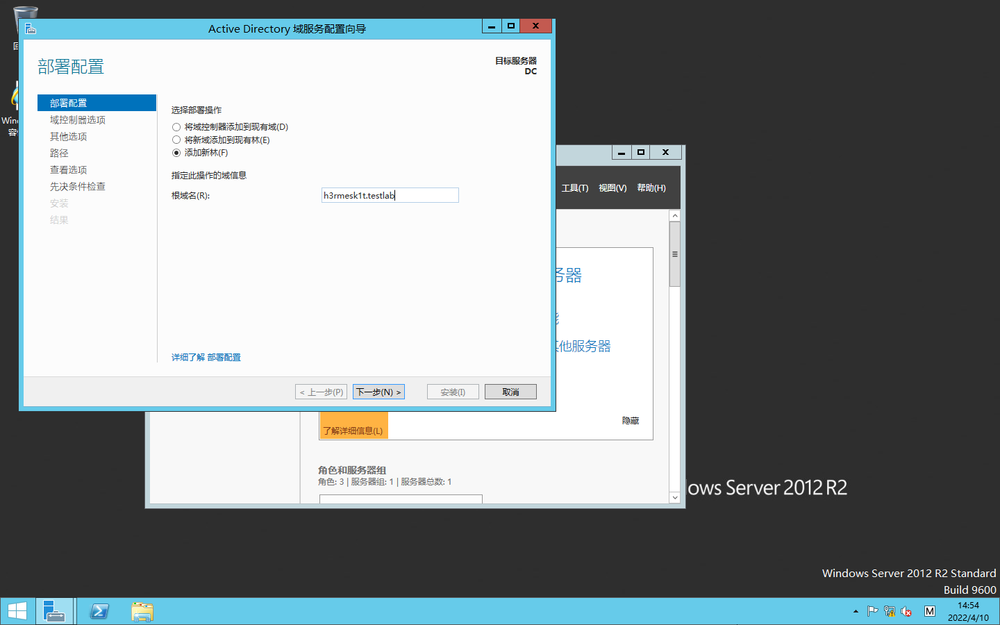

在"域控制器选项"页面, 将林功能级别、域功能级别都设置为`Windows Server 2012 R2`. 在创建新林时, 在默认情况下选择`DNS`服务器, 林中的第一个域控制器必须是全局目录服务器且不能是只读域控制器(`RODC`). 输入目录服务还原模式密码, 在开机进入安全模式修复`AD`数据库时将使用此密码.

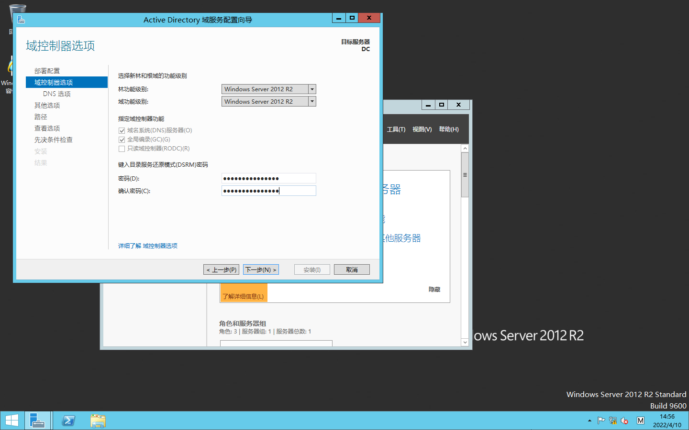

在`DNS`选项页面会出现关于`DNS`的警告, 不用理会该警告, 保持默认设置. 单击"下一步"按钮, 进入"其他选项"页面, 在`NetBIOS`域名(不支持`DNS`域名的旧系统, 如`Windows 98`、`NT`系统, 需要通过`NetBIOS`域名进行通信)页面保持默认设置. 单击"下一步"按钮, 进入"路径"界面, 指定数据库、日志、`sysvol`的存放位置, 其他选项保持默认设置. 接着单击"下一步"按钮, 保持页面上的默认设置. 当到了先决条件检查时, 如果检测出当前`Administrator`用户密码不符合要求, 这是因为`Administrator`用户将成为域`Administrator`用户, 此时去创建或修改`Administrator`用户的密码后再点击"重新运行先决条件检测", 这时候发现就`OK`了, 直接单击"安装"即可.

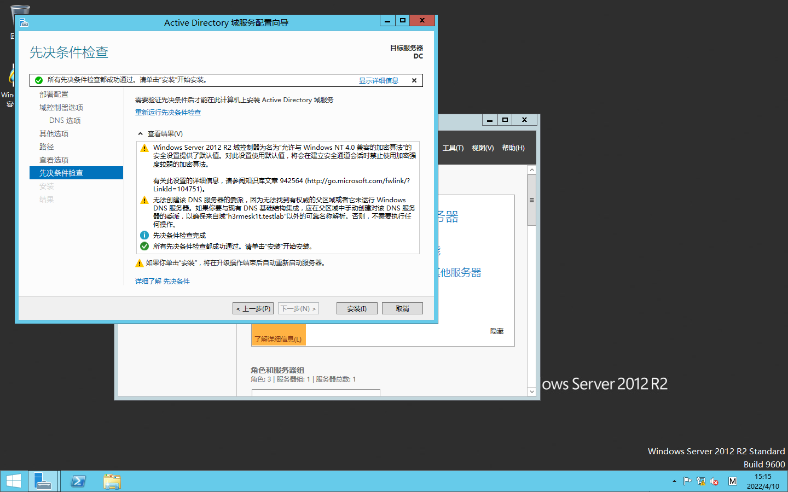

安装完成后, 需要重启服务器. 重启完成后, 需要使用域管理员账户(`H3RMESK1T\Administrator`)登录, 此时在"服务器管理器"页面就可以看到`AD DS`、`DNS`服务.

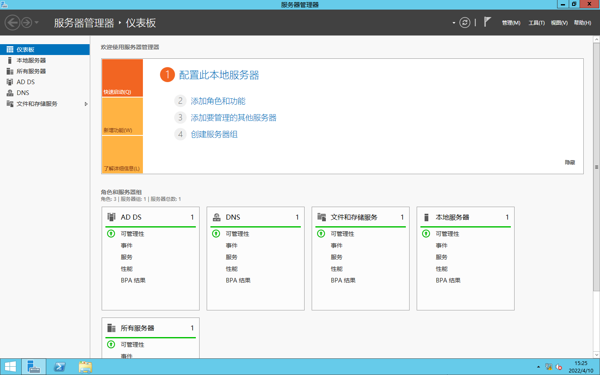

接着为`Windows7`创建域控账户, 在"`Active Directory`用户和计算机"页面转到`Users`目录并单击右键, 添加新用户.

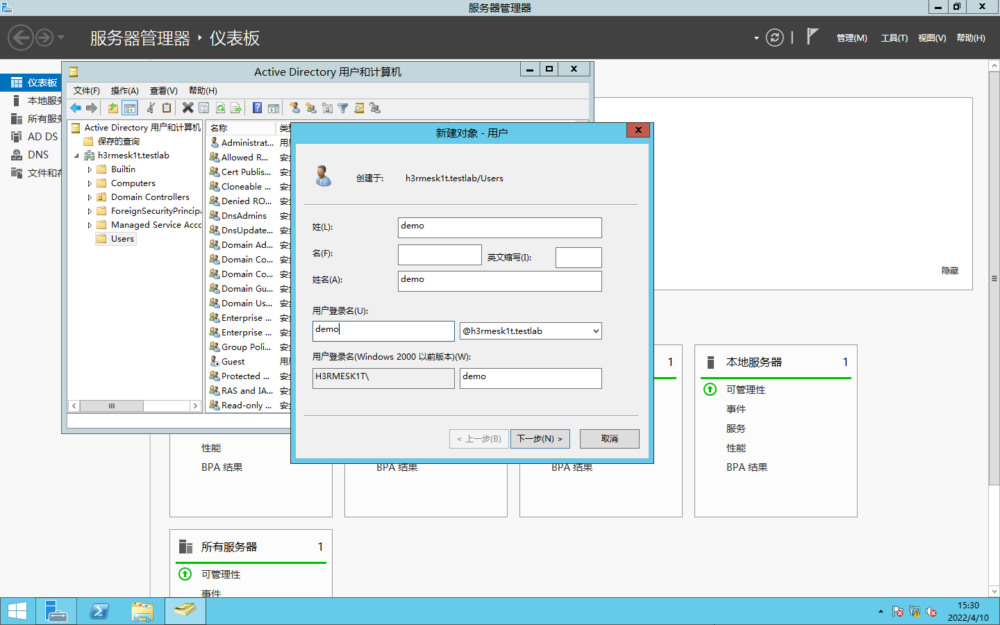

## Winodws7
将`Windows7`系统加入该域, 先设置`IP`地址为`192.168.1.2`, `DNS`地址为`192.168.1.1`, 然后查看设置并运行`ping h3rmesk1t.testlab`命令进行测试.

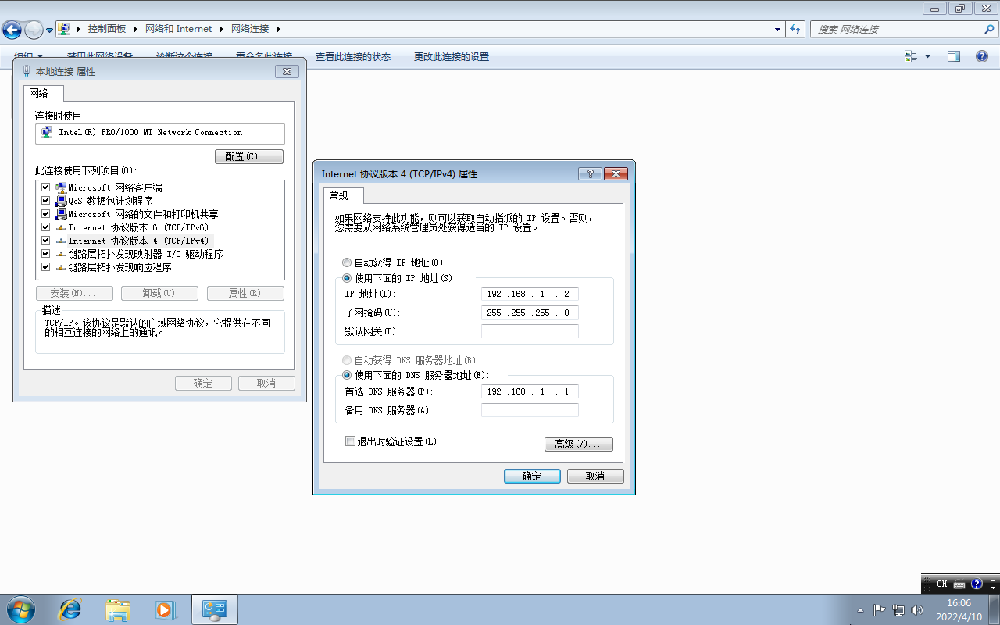

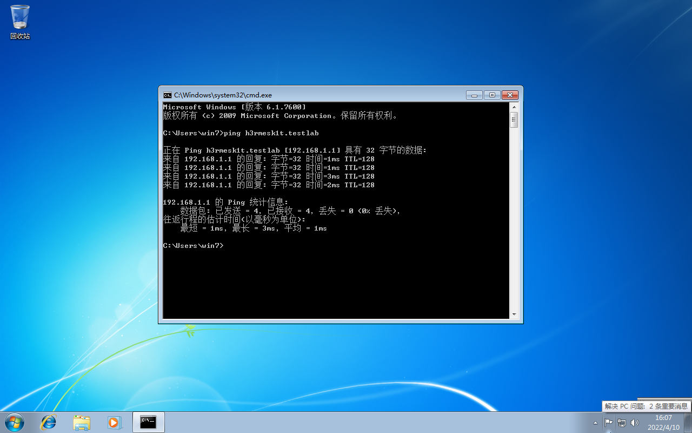

接下来将主机加入域, 更改计算机名为"WIN7", 将域名更改为`h3rmesk1t.testlab`. 单击"确定"按钮后会弹出要求输入拥有权限的域账户名称和密码的对话框, 输入域管理员用户账号和密码.

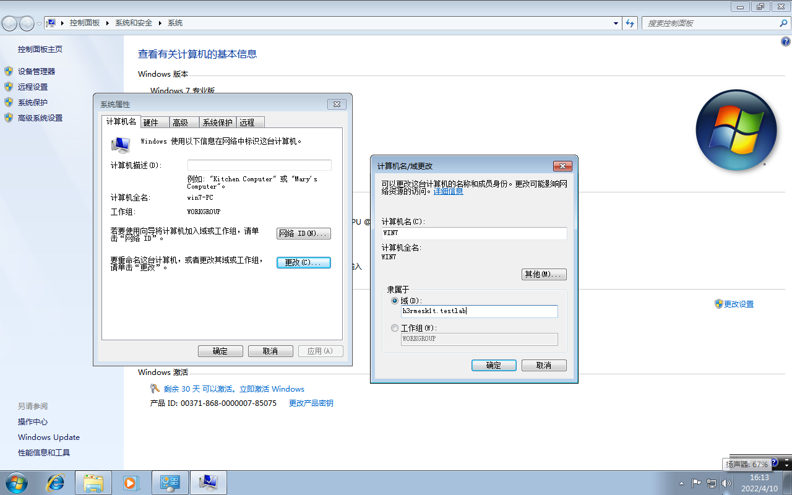

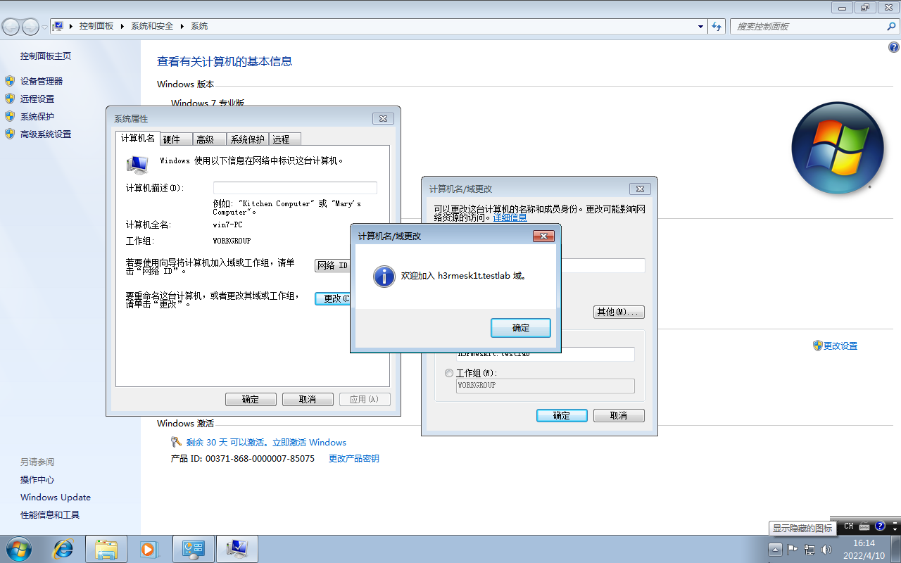

操作成功后会出现重启计算机的提示, 用创建的`demo`用户登录域即可. 此时，在`DC`中"`Active Directory`用户和计算机"页面的`Computers`项可以看到`WIN7`加入的计算机名.

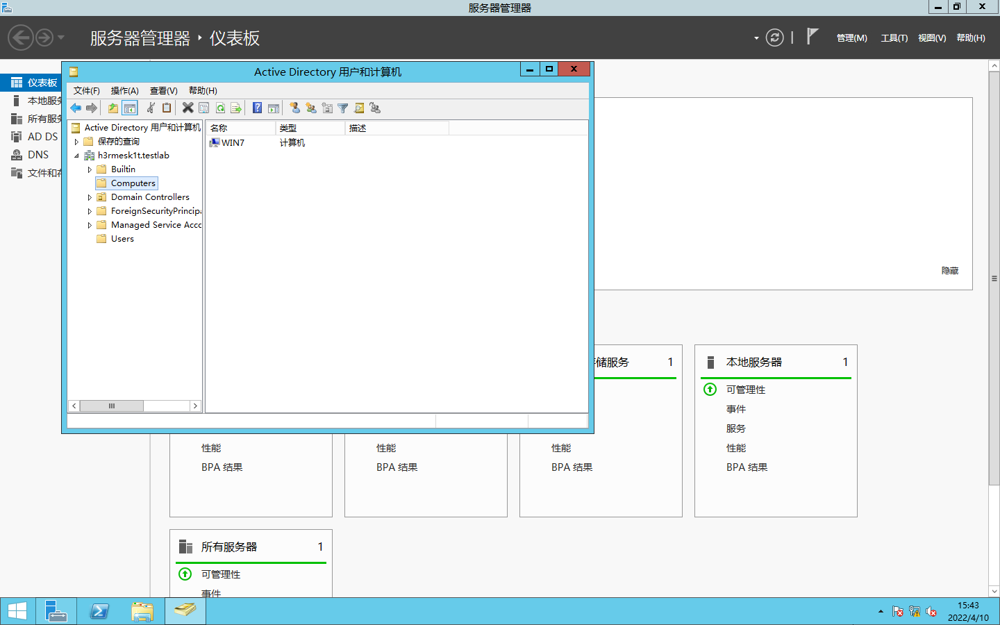

关闭防火墙后, 域控成功管理`WIN7`.

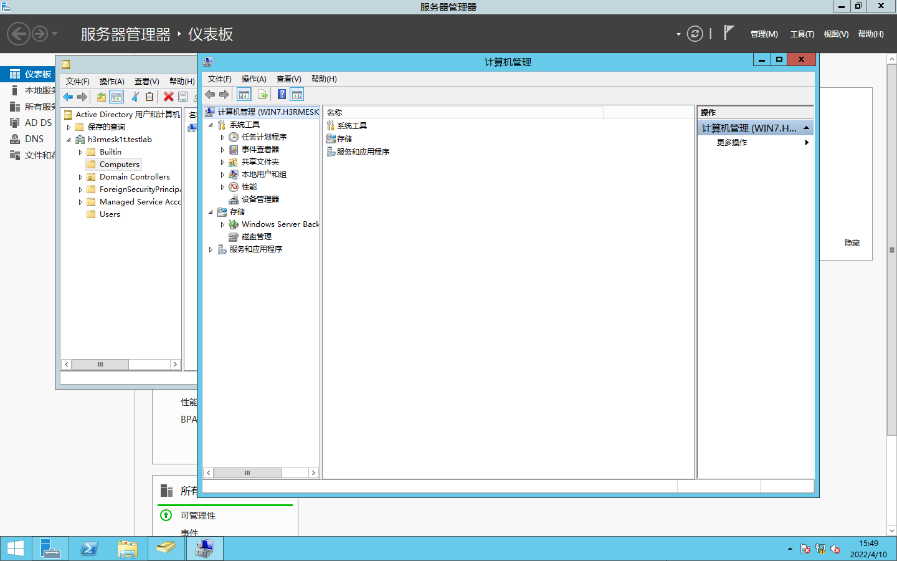

查看配置好的域内环境: `net view /domain:h3rmesk1t`.

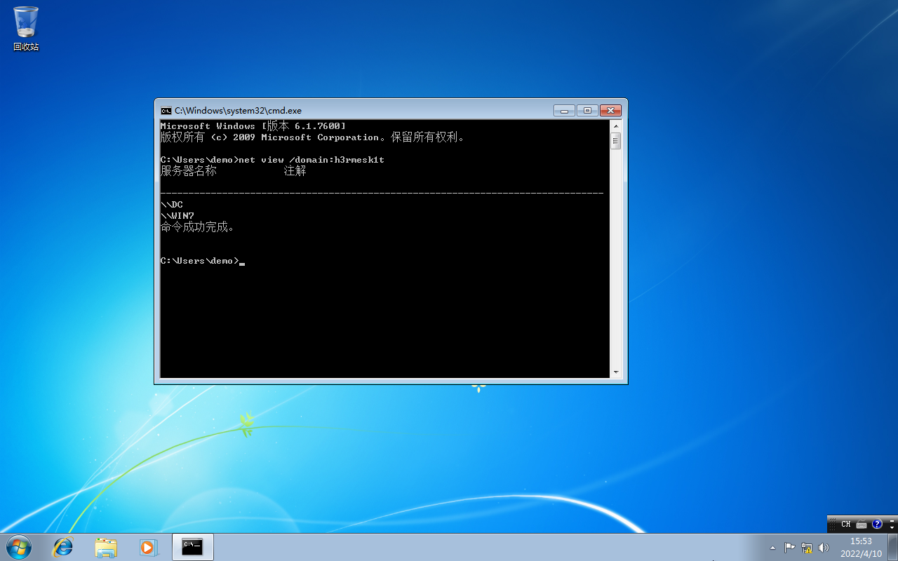
