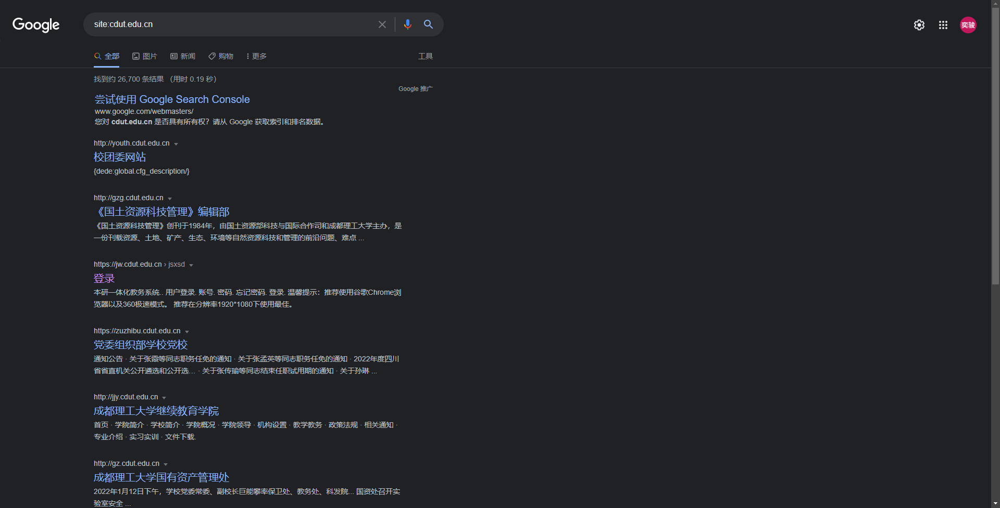
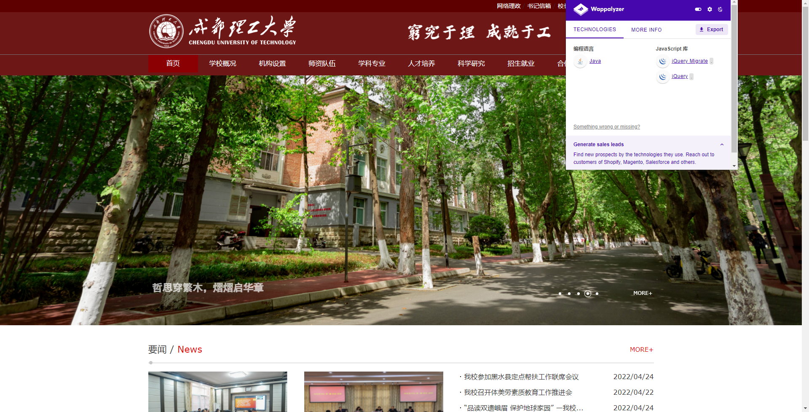

# 信息搜集

Author: H3rmesk1t

Data: 2022.04.27

# 前言
进行`web`渗透测试之前, 信息收集是基本的步骤, 信息收集的深度, 直接关系到渗透测试的成败. 打好信息收集这一基础可以让测试者选择合适和准确的渗透测试攻击方式, 缩短渗透测试的时间. 一般来说收集的信息越多越好, 通常包括以下几个部分:
 - 域名信息搜集
 - 子域名信息搜集
 - 站点信息搜集
 - 敏感信息搜集
 - 服务器信息搜集
 - 端口信息搜集
 - 真实`IP`地址识别
 - 社会工程学等

# 域名信息搜集
## Whois 查询
`Whois`是用来查询域名的IP以及所有者等信息的传输协议. 简单说, `whois`就是一个用来查询域名是否已经被注册, 以及注册域名的详细信息的数据库(如域名所有人、域名注册商), 不同域名后缀的`Whois`信息需要到不同的`Whois`数据库查询. 通过`Whois`来实现对域名信息的查询, 可以得到注册人的姓名和邮箱信息通常对测试个人站点非常有用, 因为可以通过搜索引擎和社交网络挖掘出域名所有人的很多信息.

### 在线查询
常见的`Whois`在线查询网站有:
 - [Whois 站长之家查询](http://whois.chinaz.com/)

 - [阿里云中国万网查询](https://whois.aliyun.com/)

 - [Netcraft Site Report 显示目标网站上使用的技术](http://toolbar.netcraft.com/site_report?url=)

 - [Robtex DNS 查询显示关于目标网站的全面的 DNS 信息](https://www.robtex.com/)

 - [全球Whois查询](https://www.whois365.com/cn/)

 - [站长工具爱站查询](https://whois.aizhan.com/)

### 工具查询
可以使用`kali`中自带的的`whois`工具查询, 例如: `whois freebuf.com`.

## 备案信息查询
网站备案信息是根据国家法律法规规定, 由网站所有者向国家有关部门申请的备案, 是国家信息产业部对网站的一种管理途径, 是为了防止在网上从事非法网站经营活动, 当然主要是针对国内网站.

在备案查询中我们主要关注的是: 单位信息例如名称、备案编号、网站负责人、法人、电子邮箱、联系电话等.

常用的备案信息查询网站有以下几个:
 - [ICP/IP地址/域名信息备案管理系统](http://beian.miit.gov.cn/publish/query/indexFirst.action)

 - [ICP 备案查询网](http://www.beianbeian.com/)

 - [备案吧吧](https://www.beian88.com/)

 - [天眼查](https://www.tianyancha.com/)

# 子域名信息搜集
收集子域名信息的目的:
 - 子域名枚举可以在测试范围内发现更多的域或子域, 这将增大漏洞发现的几率.
 - 有些隐藏的、被忽略的子域上运行的应用程序可能帮助我们发现重大漏洞.
 - 在同一个组织的不同域或应用程序中往往存在相同的漏洞.

当我们的攻击目标网络规模比较大时, 直接从其主域入手显然是很不理智的, 因为对于这种规模的目标, 一般其主域都是重点防护区域. 因此, 可以先进入攻击目标的某个子域, 然后再想办法迂回接近真正的目标, 这无疑是个更好的选择.

## 搜索引擎
可以利用`Google Hacking`语法搜索子域名, 以西南地区某理工大学的域名为例, 使用`site:cdut.edu.cn`语法, 如下图所示:

<div align=center></div>

这里顺带补充一下其它的`Google Hacking`语法:

```
site: 可以限制你搜索范围的域名.

inurl: 用于搜索网页上包含的URL, 这个语法对寻找网页上的搜索, 帮助之类的很有用.

intext: 只搜索网页<body>部分中包含的文字(也就是忽略了标题、URL等的文字).

intitle: 查包含关键词的页面, 一般用于社工别人的webshell密码.

filetype: 搜索文件的后缀或者扩展名.

intitle: 限制你搜索的网页标题.

link: 可以得到一个所有包含了某个指定URL的页面列表.

查找后台地址: site:域名 inurl:login|admin|manage|member|admin_login|login_admin|system|login|user|main|cms

查找文本内容: site:域名 intext:管理|后台|登陆|用户名|密码|验证码|系统|帐号|admin|login|sys|managetem|password|username.

查找可注入点: site:域名 inurl:aspx|jsp|php|asp.

查找上传漏洞: site:域名 inurl:file|load|editor|Files.

找eweb编辑器: site:域名 inurl:ewebeditor|editor|uploadfile|eweb|edit.

存在的数据库: site:域名 filetype:mdb|asp|#.

查看脚本类型: site:域名 filetype:asp/aspx/php/jsp.

迂回策略入侵: inurl:cms/data/templates/images/index/.
```

同样的, 还可以通过以下搜索引擎进行子域名的查找:
 - [FOFA](https://fofa.so/): title="公司名称" ; domain="zkaq.cn"

 - [百度](https://www.baidu.com/s): intitle=公司名称；site:zkaq.cn

 - [钟馗之眼](https://www.zoomeye.org/): site=域名即可 ;hostname:baidu.com

 - [shodan](https://www.shodan.io/): hostname:"baidu.com"

 - [360 测绘空间](https://quake.360.cn/): domain:"zkaq.cn"

## 在线查询
网上有很多子域名的查询站点, 可通过它们检索某个给定域名的子域名, 例如下列网站:
 - [DNSdumpster](https://dnsdumpster.com/)

 - [Whois 反查](http://whois.chinaz.com/)

 - [virustotal](www.virustotal.com)

 - [子域名爆破](https://phpinfo.me/domain/)

 - [IP 反查绑定域名](http://dns.aizhan.com/)

 - [Find DNS Host Records (Subdomains)](https://hackertarget.com/find-dns-host-records/)

 - [ip38 查询网](https://site.ip138.com/)

## 证书透明度公开日志枚举
证书透明度是证书授权机构的一个项目, 证书授权机构会将每个`SSL`/`TLS`证书发布到公共日志中. 一个`SSL`/`TLS`证书通常包含域名、子域名和邮件地址, 这些也经常成为攻击者非常希望获得的有用信息.

查找某个域名所属证书的最简单的方法就是使用搜索引擎来搜索一些公开的`CT`日志, 例如以下网站:
 - [crt.sh](https://crt.sh)

 - [censys](https://censys.io)

## 工具枚举
### Kali
在`kali`中的信息收集模块的`DNS`分析中, 有很多工具可以进行域名信息收集:
 - Dnsenum: 域名信息收集.
 - Dnsmap: 收集信息和枚举`DNS`信息.
 - Dnsrecon: 用于`DNS`侦察.
 - Fierce: 子域名查询.

例如, 利用`Fierce`工具, 可以进行子域名枚举. 该工具首先测试是否有域传送漏洞, 若存在则应该直接通过域传送搜集子域信息, 没有域传送漏洞则采用爆破的方式.

```bash
fierce -dns <域名>
fierce -dns <域名> -threads 100
```

### Others
实战中常见的子域名查询工具主要有:
 - Layer 子域名挖掘机
 - subDomainsbrute
 - OneForAll
 - K8
 - ESD
 - Xray
 - Goby
 - Sublist3r
 - Maltego
 - ......

# 站点信息收集
获取了子域名后, 常常需要继续对`Web`站点的信息进行搜集, 主要搜集如下信息:
 - `CMS`指纹识别
 - 历史漏洞
 - 脚本语言
 - 敏感目录/文件
 - `Waf`识别
 - ......

## CMS 指纹识别
在渗透测试中, 对目标服务器进行指纹识别是相当有必要的, 因为只有识别出相应的`Web`容器或者`CMS`, 才能查找与其相关的漏洞, 然后才能进行相应的渗透操作. `CMS`又称整站系统, 常见的CMS有: `WordPress`、`Dedecms`、`Discuz`、`PHPWEB`、`PHPWind`、`Dvbbs`、`PHPCMS`、`ECShop`、`SiteWeaver`、`ASPCMS`、帝国、`Z-Blog`等.

### 在线识别
常用的在线查询`CMS`指纹的网站:
 - [BugScaner](http://whatweb.bugscaner.com/look/)

 - [潮汐指纹](http://finger.tidesec.net/)

 - [WhatWeb](https://whatweb.net/)

 - [云悉指纹](https://www.yunsee.cn/)

例如, 利用`WhatWeb`对西南地区某理工大学进行识别:

<div align=center></div>

### 手动识别
 - 根据`HTTP`响应头判断, 重点关注`X-Powered-By`、`cookie`等字段.
 - 根据`HTML`特征, 重点关注`body`、`title`、`meta`等标签的内容和属性.
 - 根据特殊的`class`判断, `HTML`中存在特定`class`属性的某些`div`标签, 如`<body class="ke-content">`.
 - ......

## 敏感信息搜集
在`web`渗透中, 探测`Web`目录结构和隐藏的敏感文件是一个十分重要的环节, 从中可以获取网站的后台管理页面、文件上传界面、`robots.txt`, 甚至可能扫描出备份文件从而得到网站的源代码.

常见的网站目录的扫描工具主要有:
 - 御剑后台扫描工具
 - dirbuster 扫描工具
 - dirsearch 扫描工具
 - dirb
 - wwwscan
 - Spinder.py
 - Sensitivefilescan
 - Weakfilescan

还可以通过上文提到的搜索引擎搜索一些敏感文件, 通过敏感文件进一步获取需要的数据和信息.

## Waf 识别
`Web`应用防护系统, 即网站应用级入侵防御系统(Web Application Firewall, WAF). `Web`应用防火墙是通过执行一系列针对`HTTP`/`HTTPS`的安全策略来专门为`Web`应用提供保护的一款产品.

这里推荐一个常用的`Waf`指纹识别工具: [wafw00f](https://github.com/EnableSecurity/wafw00f).

# 敏感信息搜集
有时候, 针对某些安全做得很好的目标, 直接通过技术层面是无法完成渗透测试的. 此时, 便可以利用搜索引擎搜索目标暴露在互联网上的关联信息. 例如: 数据库文件、`SQL`注入、服务配置信息, 甚至是通过`Git`找到站点泄露源代码, 以及`Redis`等未授权访问、`Robots.txt`等敏感信息, 从而达到渗透目的.

## Google Hacking
上文中已经介绍过了`Google Hacking`的一些用法, 这里简单地记录一些用法:
 - 查找网站后台: `intext:后台登陆`、`intitle:后台登陆`.
 - 查找管理员登录页面: `inurl:/admin/login.php`.
 - 查找后台数据库管理页面: `inurl:/phpmyadmin/index.php`.
 - 查找指定网站后台: `site:xxx.com intext:管理`、`site:xxx.com inurl:login`、`site:xxx.com intitle:后台`.
 - 查看指定网站的文件上传漏洞: `site:xxx.com inurl:file`、`site:xxx.com inurl:load`.
 - 利用`Index of`发现允许目录浏览的`web`网站: `intitle:index of /admin`、`intitle:index of /config`、`intitle:index.of`等
 - 备份文件泄露: `intitle:index.of index.php.bak`、`inurl:index.php.bak`、`intitle:index.of www.zip`.
 - 查找`SQL`注入: `inurl:?id=1`、`inurl:php?id=1`.

更多的利用方式可以查看[GHDB 谷歌黑客数据库](https://www.exploit-db.com/google-hacking-database/).

## Github 信息泄露
`GitHub`作为开源代码平台, 给程序员提供了很多便利, 但如果使用不当, 比如将包含了账号密码、密钥等配置文件的代码上传了, 导致攻击者能发现并进一步利用这些泄露的信息, 就是一个典型的`GitHub`敏感信息泄露漏洞, 再如开发人员在开发时, 常常会先把源码提交到`github`, 最后再从远程托管网站把源码`pull`到服务器的`web`目录下, 如果忘记把`.git`文件删除, 就造成此漏洞. 利用`.git`文件恢复网站的源码, 而源码里可能会有数据库的信息.

```
site:Github.com smtp
site:Github.com smtp @qq.com
site:Github.com smtp @126.com
site:Github.com smtp @163.com
site:Github.com smtp @sina.com.cn

site:Github.com sa password
site:Github.com root password
```

## 源码备份文件
常见的源码备份文件后缀名有:
```
.tar
.tar.gz
.zip
.rar
.7z
.bak
.old
.txt
.git
.swp
........
```

# 服务器信息收集
在渗透过程中, 还需要对目标服务器的信息进行收集, 主要包括一下部分:
 - `Web`服务器指纹识别.
 - 真实`IP`地址识别.
 - 编程语言.
 - `Web`中间件.
 - 端口信息收集.
 - 后端存储技术识别.
 - ......

# 端口信息搜集
## 常见端口号
[计算机端口号对应服务快速查看](./port.html)

## 端口信息搜集
### 工具
常见的端口信息搜集工具有:
 - nmap
 - masscan
 - arp-scan
 - netdiscover

### 在线网站探测
由于使用工具通常会在目标网站留下痕迹, 这里提供一些在线网站探测方法:
 - [站长工具](http://tool.chinaz.com/port/)
 - [ThreatScan 在线网站](https://scan.top15.cn/)

## 旁站和C段扫描
旁站指的是同一服务器上的其他网站, 很多时候, 有些网站可能不是那么容易入侵. 可以查看该网站所在的服务器上是否还有其他网站, 如果有其他网站的话, 可以先拿下其他网站的`webshell`, 然后再提权拿到服务器的权限, 最后对该网站进行入侵.

对于红蓝对抗和护网, `C`段扫描比较有意义; 对于单独网站的渗透测试, `C`段扫描意义不大. `C`段指的是同一内网段内的其他服务器, 每个`IP`有`ABCD`四个段. 举个例子, `IP`地址`192.168.0.1`中, `A`段就是`192`, `B`段是`168`, `C`段是`0`, `D`段是`1`, 而`C`段嗅探的意思就是拿下它同一`C`段中的其中一台服务器, 也就是说是`D`段`1-255`中的一台服务器, 然后利用工具嗅探拿下该服务器.

旁站和C段在线查询地址: 
 - [The Web of WebScan](http://www.webscan.cc/)

# 真实 IP 地址识别
## 常规做法
在渗透测试中, 一般只会给出一个域名, 需要根据这个域名来确定目标服务器的真实`IP`. 可以通过像`www.ip138.com`这样的`IP`查询网直接获取目标的一些`IP`及域名信息, 但这里的前提是目标服务器没有使用`CDN`.

## 绕过 CDN
`CDN`的全称是`Content Delivery Network`, 即内容分发网络. `CDN`是构建在现有网络基础之上的智能虚拟网络, 依靠部署在各地的边缘服务器, 通过中心平台的负载均衡、内容分发、调度等功能模块, 使用户就近获取所需内容, 降低网络拥塞, 提高用户访问响应速度和命中率. `CDN`的关键技术主要有内容存储和分发技术. 

绕过`CDN`寻找真实`IP`的常见方法:

 - `DNS`历史解析记录:

```
iphistory: https://viewdns.info/iphistory/
DNS查询: https://dnsdb.io/zh-cn/
微步在线: https://x.threatbook.cn/
域名查询: https://site.ip138.com/
DNS历史查询: https://securitytrails.com/
Netcraft: https://sitereport.netcraft.com/?url=github.com
```

 - 查找子域名: 很多时候, 一些重要的站点会做`CDN`, 而一些子域名站点并没有加入`CDN`, 而且跟主站在同一个`C`段内, 这时候可以通过查找子域名来查找网站的真实`IP`. 

 - 网站邮件头信息: 比如说, 邮箱注册, 邮箱找回密码、`RSS`邮件订阅等功能场景, 通过网站给自己发送邮件, 从而让目标主动暴露他们的真实的`IP`, 查看邮件头信息, 获取到网站的真实`IP`. 

 - 网络空间安全引擎搜索: 通过关键字或网站域名, 就可以找出被收录的`IP`, 很多时候获取到的就是网站的真实`IP`. 

 - 利用SSL证书寻找真实`IP`: 证书颁发机构(CA)必须将他们发布的每个`SSL`/`TLS`证书发布到公共日志中, `SSL`/`TLS`证书通常包含域名、子域名和电子邮件地址. 因此, `SSL`/`TLS`证书成为了攻击者的切入点.

 - 国外主机解析域名: 大部分`CDN`厂商因为各种原因只做了国内的线路, 而针对国外的线路可能几乎没有, 此时使用国外的`DNS`进行查询, 很可能获取到真实`IP`. 

```
https://asm.ca.com/zh_cn/ping.php
http://host-tracker.com/
http://www.webpagetest.org/
https://dnscheck.pingdom.com/
```

# 社会工程学
该手段层出不穷, 这里就不做详细的介绍. 例如, 攻击方性感小姐姐诱惑防守方.